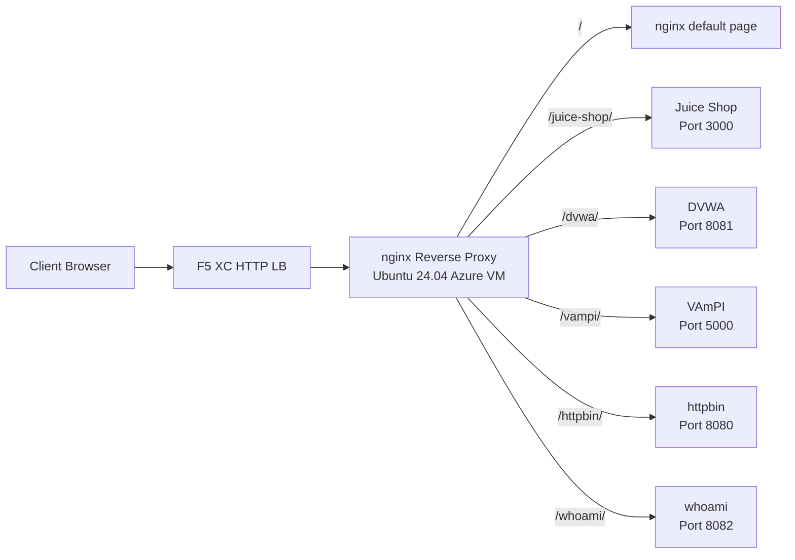

## Purpose

This component provides a single origin server hosting multiple vulnerable web applications for security testing demos. It represents the "origin" in a typical load balancer architecture -- the backend content server that an F5 XC HTTP load balancer protects.

In production architectures:

```
End User -> F5 XC HTTP LB (WAF/Bot/API Security) -> Origin Server -> Application
```

This component replaces a real production application server with a purpose-built VM running well-known vulnerable applications that trigger WAF rules, API security policies, and bot detection.

## Architecture



The nginx reverse proxy on the VM:

- **Listens on port 80** for all inbound HTTP traffic
- **Routes by path prefix** to the appropriate Docker container
- **Serves a default page** at `/` for health checks and basic connectivity testing
- **Passes client headers** (`X-Real-IP`, `X-Forwarded-For`, `X-Forwarded-Proto`) for origin visibility

## Application Mapping

| Path | Container | Port | Purpose |
|---|---|---|---|
| `/` | nginx default | -- | Health check, basic connectivity |
| `/health` | nginx | -- | JSON health endpoint |
| `/juice-shop/` | OWASP Juice Shop | 3000 | Modern web app security (XSS, injection, CSRF) |
| `/dvwa/` | DVWA | 8081 | Classic WAF testing with adjustable difficulty |
| `/vampi/` | VAmPI | 5000 | REST API security testing (OWASP API Top 10) |
| `/httpbin/` | httpbin | 8080 | HTTP request/response service for API demos |
| `/whoami/` | whoami | 8082 | Request diagnostics -- shows all headers, client IP, hostname |

## Modular Component Design

This is one piece of a larger lab environment. Each component is self-contained and deployed independently:

- **This component** provides the origin server (nginx + Docker containers on Azure VM)
- **CDN Simulator** provides the CDN edge layer (nginx caching on Azure VM)
- **Other components** provide the F5 XC configuration, DNS, WAF policies, API security, etc.

The human operator adds components one at a time. Each component's documentation is written so an AI assistant can read it and deploy the infrastructure autonomously.

## Why These Applications

| Application | Why Selected |
|---|---|
| **Juice Shop** | OWASP flagship project; modern Node.js SPA with 100+ challenges covering the OWASP Top 10; actively maintained |
| **DVWA** | Industry standard for WAF testing; adjustable security levels (low/medium/high/impossible); PHP-based for diversity |
| **VAmPI** | Purpose-built for OWASP API Security Top 10; REST API with known vulnerabilities; lightweight Flask app |
| **httpbin** | Kenneth Reitz's canonical HTTP testing service; useful for basic API demos and request inspection |
| **whoami** | Traefik's request echo server; shows full request details as the origin sees them -- essential for verifying F5 XC header injection |
