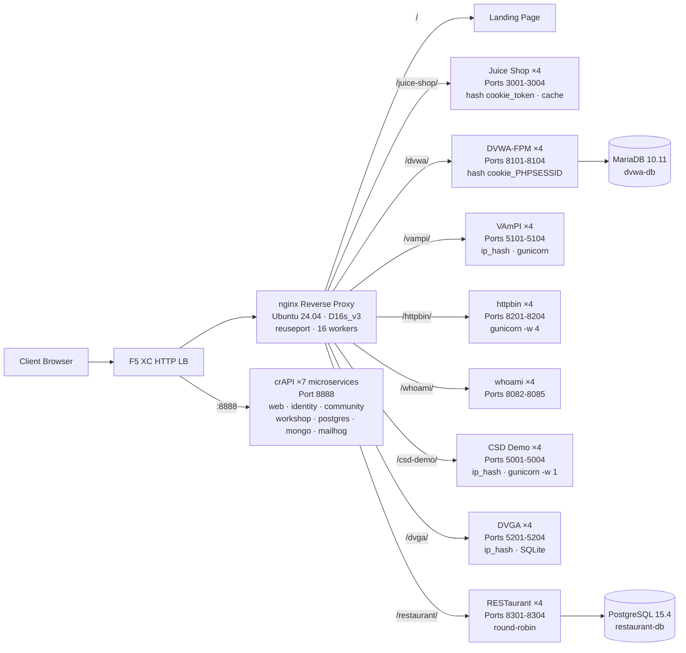

## Purpose

This component provides a single origin server hosting multiple vulnerable web applications for security testing demos. It represents the "origin" in a typical load balancer architecture -- the backend content server that an F5 XC HTTP load balancer protects.

In production architectures:

```
End User -> F5 XC HTTP LB (WAF/Bot/API Security) -> Origin Server -> Application
```

This component replaces a real production application server with a purpose-built VM running well-known vulnerable applications that trigger WAF rules, API security policies, and bot detection.

## Architecture



**41 containers** on a Standard_D16s_v3 VM (16 vCPU, 64 GiB RAM, 60 GiB disk).

The nginx reverse proxy:

- **Listens on port 80** with `reuseport` and `backlog=4096` for high-concurrency CDN traffic
- **Routes by path prefix** to load-balanced upstream pools (4 instances per application)
- **Sticky sessions** prevent state loss: `hash $cookie_token` for Juice Shop, `hash $cookie_PHPSESSID` for DVWA, `ip_hash` for VAmPI and CSD Demo (SQLite/in-memory state per instance)
- **Proxy cache** for Juice Shop static assets (10 MB zone, 100 MB max, 60 s TTL)
- **Access logging disabled** to prevent disk exhaustion under CDN load testing (logrotate as defense-in-depth)
- **Passes client headers** (`X-Real-IP`, `X-Forwarded-For`, `X-Forwarded-Proto`) for origin visibility
- **Kernel tuning** via sysctl: `somaxconn=65535`, `tcp_tw_reuse=1`, `ip_local_port_range=1024-65535`

## Application Mapping

| Path | Upstream | Instances | Ports | Sticky Session | Purpose |
|---|---|---|---|---|---|
| `/` | nginx | -- | -- | -- | Landing page with links to all apps |
| `/health` | nginx | -- | -- | -- | JSON health endpoint (9 apps listed) |
| `/juice-shop/` | juice_shop | 4 | 3001-3004 | `hash $cookie_token` | Modern web app security (XSS, injection, CSRF) |
| `/dvwa/` | dvwa | 4 + MariaDB | 8101-8104 | `hash $cookie_PHPSESSID` | Classic WAF testing with adjustable difficulty |
| `/vampi/` | vampi | 4 | 5101-5104 | `ip_hash` | REST API security testing (OWASP API Top 10) |
| `/httpbin/` | httpbin_up | 4 | 8201-8204 | -- | HTTP request/response service for API demos |
| `/whoami/` | whoami_up | 4 | 8082-8085 | -- | Request diagnostics -- shows all headers, client IP |
| `/csd-demo/` | csd_demo | 4 | 5001-5004 | `ip_hash` | Client-Side Defense testing (Magecart attacks) |
| `/dvga/` | dvga | 4 | 5201-5204 | `ip_hash` | GraphQL API security testing (injection, DoS, auth bypass) |
| `/restaurant/` | restaurant | 4 + PostgreSQL | 8301-8304 | -- | REST API security (OWASP API Top 10 2023) |
| `:8888` | crapi | 7 microservices | 8888 | -- | OWASP crAPI (BOLA, BFLA, mass assignment, SSRF, JWT) |

## Modular Component Design

This is one piece of a larger lab environment. Each component is self-contained and deployed independently:

- **This component** provides the origin server (nginx + Docker containers on Azure VM)
- **CDN Simulator** provides the CDN edge layer (nginx caching on Azure VM)
- **Other components** provide the F5 XC configuration, DNS, WAF policies, API security, etc.

The human operator adds components one at a time. Each component's documentation is written so an AI assistant can read it and deploy the infrastructure autonomously.

## Why These Applications

| Application | Why Selected |
|---|---|
| **Juice Shop** | OWASP flagship project; modern Node.js SPA with 100+ challenges covering the OWASP Top 10; actively maintained; 4 instances with proxy cache |
| **DVWA** | Industry standard for WAF testing; adjustable security levels (low/medium/high/impossible); custom php-fpm + nginx build for performance; shared MariaDB 10.11 backend |
| **VAmPI** | Purpose-built for OWASP API Security Top 10; REST API with known vulnerabilities; gunicorn with 4 workers per instance; ip_hash sticky for SQLite consistency |
| **httpbin** | Kenneth Reitz's canonical HTTP testing service; gunicorn with 4 gevent workers; useful for API demos and request inspection |
| **whoami** | Traefik's request echo server; shows full request details as the origin sees them -- essential for verifying F5 XC header injection |
| **CSD Demo** | Custom checkout page with 5 toggleable Magecart-style attacks (card skimmer, formjacker, keylogger, cryptominer, DOM hijack); exfil endpoint + attacker dashboard; gunicorn single-worker for in-memory state persistence |
| **DVGA** | Damn Vulnerable GraphQL Application; GraphQL-specific vulnerabilities including injection, DoS, batching attacks, and authorization bypass; GraphiQL UI for interactive exploration; ip_hash sticky for SQLite per instance |
| **RESTaurant** | Damn Vulnerable RESTaurant API Game; purpose-built for OWASP API Security Top 10 2023; FastAPI with Swagger UI; shared PostgreSQL 15.4 backend; covers BOLA, BFLA, mass assignment, SSRF, and injection |
| **crAPI** | OWASP Completely Ridiculous API; 7-microservice architecture covering BOLA, BFLA, mass assignment, SSRF, JWT manipulation, and NoSQL injection; dedicated port 8888 (SPA with hardcoded API paths); MailHog for email capture |
