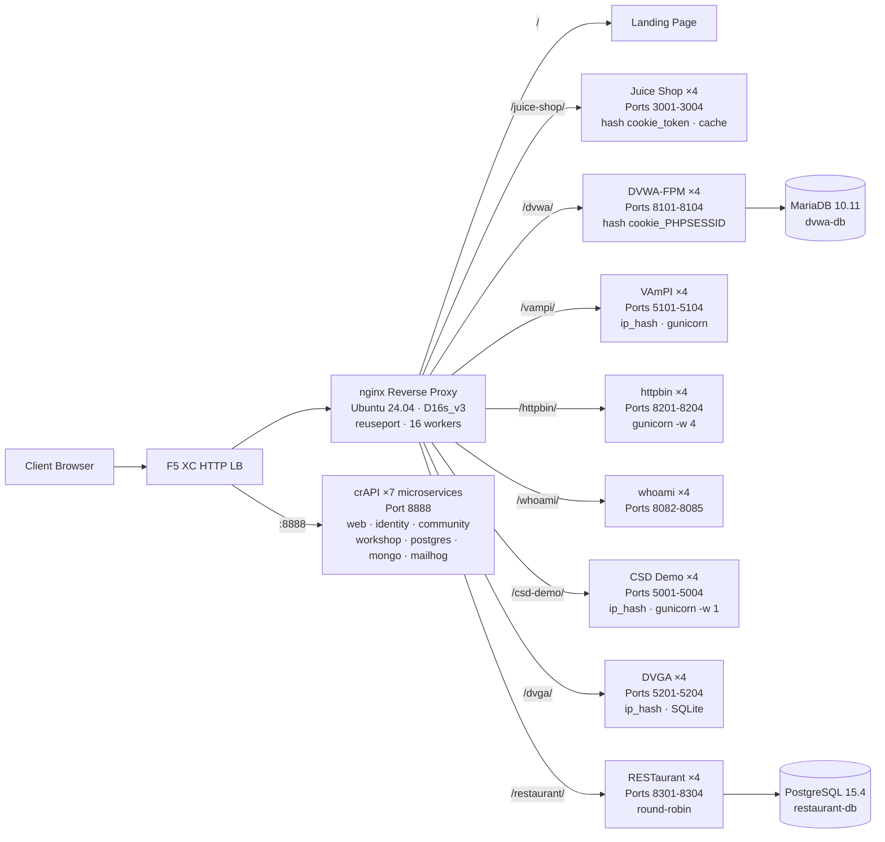

## الغرض

يوفر هذا المكون خادم أصل واحد يستضيف تطبيقات ويب متعددة معرضة للثغرات لأغراض عروض اختبار الأمان. يمثل "الأصل" في بنية موازن الأحمال النموذجية -- خادم المحتوى الخلفي الذي يحميه موازن أحمال F5 XC HTTP.

في البنى الإنتاجية:

```
End User -> F5 XC HTTP LB (WAF/Bot/API Security) -> Origin Server -> Application
```

يستبدل هذا المكون خادم تطبيقات إنتاجي حقيقي بآلة افتراضية مُعدّة لهذا الغرض تشغّل تطبيقات معروفة بثغراتها تُفعّل قواعد WAF وسياسات أمان واجهات API واكتشاف الروبوتات.

## البنية المعمارية



**41 حاوية** على آلة افتراضية من نوع Standard_D16s_v3 (16 وحدة معالجة مركزية افتراضية، 64 جيبي بايت ذاكرة وصول عشوائي، 60 جيبي بايت قرص).

الوكيل العكسي nginx:

- **يستمع على المنفذ 80** مع `reuseport` و `backlog=4096` لحركة CDN عالية التزامن
- **يوجّه حسب بادئة المسار** إلى مجموعات المنبع الموزّعة (4 نسخ لكل تطبيق)
- **الجلسات الثابتة** تمنع فقدان الحالة: `hash $cookie_token` لـ Juice Shop، `hash $cookie_PHPSESSID` لـ DVWA، `ip_hash` لـ VAmPI و CSD Demo (حالة SQLite/ذاكرة لكل نسخة)
- **ذاكرة التخزين المؤقت للوكيل** لأصول Juice Shop الثابتة (منطقة 10 ميجابايت، حد أقصى 100 ميجابايت، مدة صلاحية 60 ثانية)
- **تسجيل الوصول معطّل** لمنع استنفاد القرص أثناء اختبار حمل CDN (logrotate كطبقة حماية إضافية)
- **يمرر ترويسات العميل** (`X-Real-IP`، `X-Forwarded-For`، `X-Forwarded-Proto`) لرؤية الأصل
- **ضبط النواة** عبر sysctl: `somaxconn=65535`، `tcp_tw_reuse=1`، `ip_local_port_range=1024-65535`

## خريطة التطبيقات

| المسار | المنبع | النسخ | المنافذ | الجلسة الثابتة | الغرض |
|---|---|---|---|---|---|
| `/` | nginx | -- | -- | -- | صفحة هبوط تحتوي روابط لجميع التطبيقات |
| `/health` | nginx | -- | -- | -- | نقطة نهاية صحية بتنسيق JSON (9 تطبيقات مدرجة) |
| `/juice-shop/` | juice_shop | 4 | 3001-3004 | `hash $cookie_token` | أمان تطبيقات الويب الحديثة (XSS، الحقن، CSRF) |
| `/dvwa/` | dvwa | 4 + MariaDB | 8101-8104 | `hash $cookie_PHPSESSID` | اختبار WAF الكلاسيكي مع مستويات صعوبة قابلة للتعديل |
| `/vampi/` | vampi | 4 | 5101-5104 | `ip_hash` | اختبار أمان واجهات REST API (OWASP API Top 10) |
| `/httpbin/` | httpbin_up | 4 | 8201-8204 | -- | خدمة طلب/استجابة HTTP لعروض API |
| `/whoami/` | whoami_up | 4 | 8082-8085 | -- | تشخيصات الطلب -- يعرض جميع الترويسات وعنوان IP للعميل |
| `/csd-demo/` | csd_demo | 4 | 5001-5004 | `ip_hash` | اختبار الدفاع من جانب العميل (هجمات Magecart) |
| `/dvga/` | dvga | 4 | 5201-5204 | `ip_hash` | اختبار أمان واجهات GraphQL API (الحقن، حجب الخدمة، تجاوز المصادقة) |
| `/restaurant/` | restaurant | 4 + PostgreSQL | 8301-8304 | -- | أمان واجهات REST API (OWASP API Top 10 2023) |
| `:8888` | crapi | 7 خدمات مصغرة | 8888 | -- | OWASP crAPI (BOLA، BFLA، التعيين الجماعي، SSRF، JWT) |

## تصميم المكونات المعيارية

هذا جزء واحد من بيئة مختبر أكبر. كل مكون مستقل بذاته ويُنشر بشكل مستقل:

- **هذا المكون** يوفر خادم الأصل (nginx + حاويات Docker على آلة Azure الافتراضية)
- **محاكي CDN** يوفر طبقة حافة CDN (تخزين nginx المؤقت على آلة Azure الافتراضية)
- **مكونات أخرى** توفر تكوين F5 XC، DNS، سياسات WAF، أمان API، إلخ.

يضيف المشغّل البشري المكونات واحدًا تلو الآخر. وثائق كل مكون مكتوبة بحيث يمكن لمساعد ذكاء اصطناعي قراءتها ونشر البنية التحتية بشكل مستقل.

## لماذا هذه التطبيقات

| التطبيق | سبب الاختيار |
|---|---|
| **Juice Shop** | مشروع OWASP الرئيسي؛ تطبيق صفحة واحدة حديث بـ Node.js يحتوي أكثر من 100 تحدٍّ يغطي OWASP Top 10؛ يُصان بنشاط؛ 4 نسخ مع ذاكرة تخزين مؤقت للوكيل |
| **DVWA** | المعيار الصناعي لاختبار WAF؛ مستويات أمان قابلة للتعديل (منخفض/متوسط/عالٍ/مستحيل)؛ بناء مخصص بـ php-fpm + nginx للأداء؛ قاعدة بيانات MariaDB 10.11 مشتركة |
| **VAmPI** | مُصمم خصيصًا لـ OWASP API Security Top 10؛ واجهة REST API تحتوي ثغرات معروفة؛ gunicorn مع 4 عمال لكل نسخة؛ ip_hash ثابت لاتساق SQLite |
| **httpbin** | خدمة اختبار HTTP الأساسية من Kenneth Reitz؛ gunicorn مع 4 عمال gevent؛ مفيد لعروض API وفحص الطلبات |
| **whoami** | خادم صدى الطلبات من Traefik؛ يعرض تفاصيل الطلب الكاملة كما يراها الأصل -- ضروري للتحقق من حقن ترويسات F5 XC |
| **CSD Demo** | صفحة دفع مخصصة مع 5 هجمات بأسلوب Magecart قابلة للتبديل (سارق بطاقات، اختطاف نماذج، مسجل مفاتيح، تعدين عملات رقمية، اختطاف DOM)؛ نقطة نهاية تسريب + لوحة تحكم المهاجم؛ gunicorn بعامل واحد للحفاظ على حالة الذاكرة |
| **DVGA** | تطبيق GraphQL المعرض للثغرات؛ ثغرات خاصة بـ GraphQL تشمل الحقن وحجب الخدمة وهجمات التجميع وتجاوز التفويض؛ واجهة GraphiQL للاستكشاف التفاعلي؛ ip_hash ثابت لـ SQLite لكل نسخة |
| **RESTaurant** | لعبة واجهة RESTaurant API المعرضة للثغرات؛ مُصممة خصيصًا لـ OWASP API Security Top 10 2023؛ FastAPI مع واجهة Swagger؛ قاعدة بيانات PostgreSQL 15.4 مشتركة؛ تغطي BOLA وBFLA والتعيين الجماعي وSSRF والحقن |
| **crAPI** | OWASP Completely Ridiculous API؛ بنية 7 خدمات مصغرة تغطي BOLA وBFLA والتعيين الجماعي وSSRF والتلاعب بـ JWT وحقن NoSQL؛ منفذ مخصص 8888 (تطبيق صفحة واحدة بمسارات API ثابتة)؛ MailHog لالتقاط البريد الإلكتروني |
