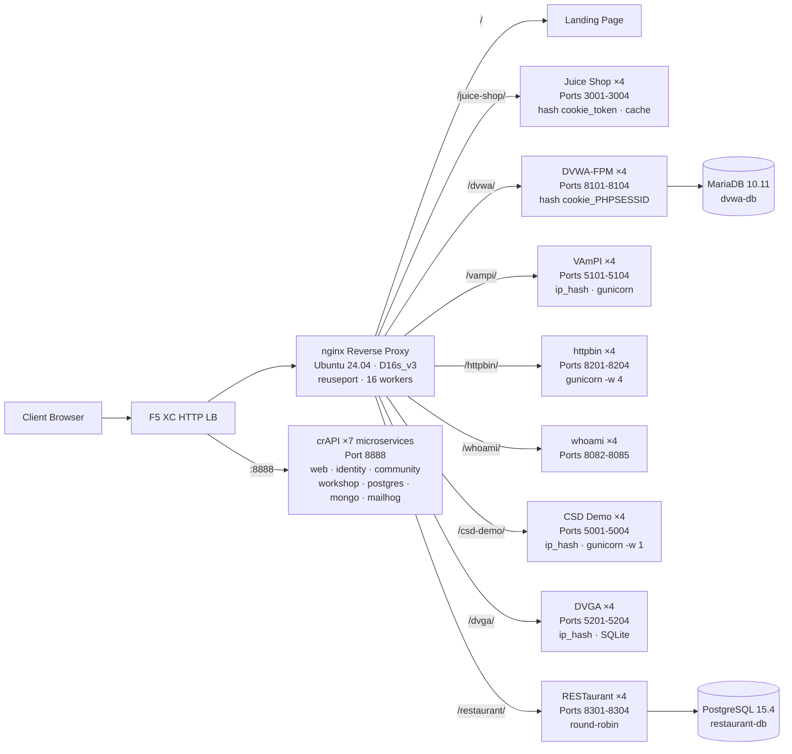

## الغرض

يوفر هذا المكون خادم مصدر واحد يستضيف تطبيقات ويب متعددة قابلة للاختراق لأغراض اختبار الأمان وعروض التوضيح. ويمثل "المصدر" في بنية موازن التحميل النموذجية -- خادم المحتوى الخلفي الذي يحميه موازن تحميل F5 XC HTTP.

في بيئات الإنتاج:

```
End User -> F5 XC HTTP LB (WAF/Bot/API Security) -> Origin Server -> Application
```

يحل هذا المكون محل خادم تطبيقات الإنتاج الفعلي بجهاز VM مبني لهذا الغرض، يشغّل تطبيقات معروفة قابلة للاختراق تُفعّل قواعد WAF وسياسات أمان API وكشف البوتات.

## البنية المعمارية



**41 حاوية** على جهاز VM من نوع Standard_D16s_v3 (16 vCPU، 64 GiB RAM، 60 GiB قرص).

يقوم الوكيل العكسي nginx بما يلي:

- **الاستماع على المنفذ 80** مع `reuseport` و`backlog=4096` لاستيعاب حركة مرور CDN عالية التزامن
- **التوجيه عبر بادئة المسار** إلى تجمعات upstream موزونة التحميل (4 مثيلات لكل تطبيق)
- **الجلسات الثابتة** لمنع فقدان الحالة: `hash $cookie_token` لـ Juice Shop، و`hash $cookie_PHPSESSID` لـ DVWA، و`ip_hash` لـ VAmPI وCSD Demo (حالة SQLite/في الذاكرة لكل مثيل)
- **Proxy cache** للأصول الثابتة في Juice Shop (منطقة 10 MB، بحد أقصى 100 MB، مدة صلاحية 60 ثانية)
- **تعطيل تسجيل الوصول** لمنع استنفاد القرص تحت اختبار حمل CDN (مع logrotate كطبقة دفاع إضافية)
- **تمرير رؤوس العميل** (`X-Real-IP` و`X-Forwarded-For` و`X-Forwarded-Proto`) لرؤية المصدر
- **ضبط النواة** عبر sysctl: `somaxconn=65535` و`tcp_tw_reuse=1` و`ip_local_port_range=1024-65535`

## مخطط التطبيقات

| المسار | Upstream | المثيلات | المنافذ | الجلسة الثابتة | الغرض |
|---|---|---|---|---|---|
| `/` | nginx | -- | -- | -- | صفحة الهبوط مع روابط لجميع التطبيقات |
| `/health` | nginx | -- | -- | -- | نقطة نهاية JSON للفحص الصحي (9 تطبيقات مدرجة) |
| `/juice-shop/` | juice_shop | 4 | 3001-3004 | `hash $cookie_token` | أمان تطبيقات الويب الحديثة (XSS، الحقن، CSRF) |
| `/dvwa/` | dvwa | 4 + MariaDB | 8101-8104 | `hash $cookie_PHPSESSID` | اختبار WAF الكلاسيكي بمستوى صعوبة قابل للضبط |
| `/vampi/` | vampi | 4 | 5101-5104 | `ip_hash` | اختبار أمان REST API (OWASP API Top 10) |
| `/httpbin/` | httpbin_up | 4 | 8201-8204 | -- | خدمة طلب/استجابة HTTP لعروض API |
| `/whoami/` | whoami_up | 4 | 8082-8085 | -- | تشخيصات الطلبات -- يعرض جميع الرؤوس وعنوان IP للعميل |
| `/csd-demo/` | csd_demo | 4 | 5001-5004 | `ip_hash` | اختبار الدفاع من جهة العميل (هجمات Magecart) |
| `/dvga/` | dvga | 4 | 5201-5204 | `ip_hash` | اختبار أمان GraphQL API (الحقن، DoS، تجاوز المصادقة) |
| `/restaurant/` | restaurant | 4 + PostgreSQL | 8301-8304 | -- | أمان REST API (OWASP API Top 10 2023) |
| `:8888` | crapi | 7 microservices | 8888 | -- | OWASP crAPI (BOLA، BFLA، mass assignment، SSRF، JWT) |

## تصميم المكونات المعيارية

هذا المكون جزء من بيئة مختبر أكبر. كل مكون مستقل بذاته ويُنشر بشكل مستقل:

- **هذا المكون** يوفر خادم المصدر (nginx + حاويات Docker على Azure VM)
- **محاكي CDN** يوفر طبقة حافة CDN (nginx مع التخزين المؤقت على Azure VM)
- **المكونات الأخرى** توفر إعداد F5 XC، وDNS، وسياسات WAF، وأمان API، وغيرها

يضيف المشغل البشري المكونات واحدًا تلو الآخر. توثيق كل مكون مكتوب بحيث يستطيع مساعد الذكاء الاصطناعي قراءته ونشر البنية التحتية باستقلالية.

## لماذا هذه التطبيقات

| التطبيق | سبب الاختيار |
|---|---|
| **Juice Shop** | المشروع الرائد لـ OWASP؛ تطبيق SPA حديث بـ Node.js مع أكثر من 100 تحدٍّ يغطي OWASP Top 10؛ يُصان بنشاط؛ 4 مثيلات مع proxy cache |
| **DVWA** | المعيار الصناعي لاختبار WAF؛ مستويات أمان قابلة للضبط (منخفض/متوسط/عالٍ/مستحيل)؛ بناء مخصص بـ php-fpm + nginx للأداء؛ خلفية MariaDB 10.11 مشتركة |
| **VAmPI** | مبني خصيصًا لـ OWASP API Security Top 10؛ REST API بثغرات معروفة؛ gunicorn مع 4 عمال لكل مثيل؛ ip_hash ثابت لاتساق SQLite |
| **httpbin** | خدمة اختبار HTTP الأساسية لـ Kenneth Reitz؛ gunicorn مع 4 عمال gevent؛ مفيد لعروض API وفحص الطلبات |
| **whoami** | خادم صدى الطلبات من Traefik؛ يعرض تفاصيل الطلب الكاملة كما يراها المصدر -- ضروري للتحقق من حقن رؤوس F5 XC |
| **CSD Demo** | صفحة دفع مخصصة مع 5 هجمات بأسلوب Magecart قابلة للتفعيل (ناسخ البطاقة، حاقن النماذج، مسجّل لوحة المفاتيح، تعدين العملات المشفرة، اختطاف DOM)؛ نقطة نهاية للتسريب + لوحة تحكم المهاجم؛ gunicorn بعامل واحد للحفاظ على الحالة في الذاكرة |
| **DVGA** | Damn Vulnerable GraphQL Application؛ ثغرات خاصة بـ GraphQL تشمل الحقن وDoS وهجمات التجميع وتجاوز التفويض؛ واجهة GraphiQL للاستكشاف التفاعلي؛ ip_hash ثابت لـ SQLite لكل مثيل |
| **RESTaurant** | لعبة Damn Vulnerable RESTaurant API؛ مبنية خصيصًا لـ OWASP API Security Top 10 2023؛ FastAPI مع Swagger UI؛ خلفية PostgreSQL 15.4 مشتركة؛ تغطي BOLA وBFLA وmass assignment وSSRF والحقن |
| **crAPI** | OWASP Completely Ridiculous API؛ بنية 7 microservices تغطي BOLA وBFLA وmass assignment وSSRF ومعالجة JWT وحقن NoSQL؛ منفذ مخصص 8888 (SPA بمسارات API مثبّتة في الكود)؛ MailHog لالتقاط البريد الإلكتروني |
