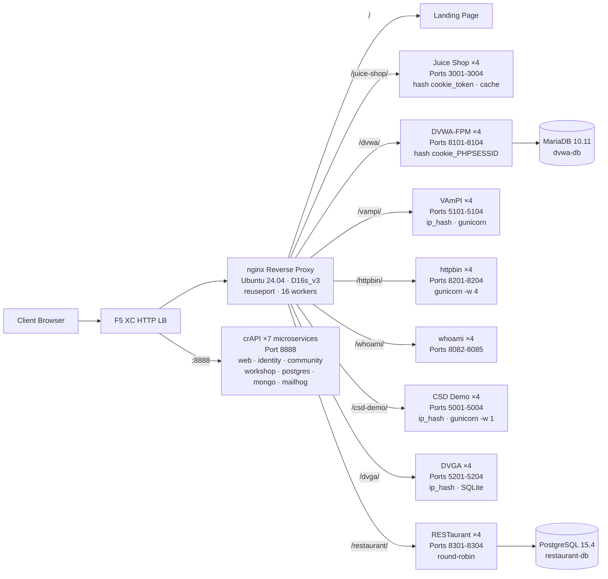

## الغرض

يوفر هذا المكوّن خادم أصل واحد يستضيف تطبيقات ويب متعددة معرّضة للثغرات لأغراض عروض اختبار الأمان. يمثل "الأصل" في بنية موزع الحمل النموذجية -- خادم المحتوى الخلفي الذي يحميه موزع حمل F5 XC HTTP.

في البنى الإنتاجية:

```
End User -> F5 XC HTTP LB (WAF/Bot/API Security) -> Origin Server -> Application
```

يستبدل هذا المكوّن خادم تطبيق إنتاجي حقيقي بجهاز افتراضي مصمم خصيصاً يشغّل تطبيقات معروفة بثغراتها الأمنية التي تفعّل قواعد WAF وسياسات أمان API واكتشاف الروبوتات.

## البنية المعمارية



**41 حاوية** على جهاز افتراضي Standard_D16s_v3 (16 وحدة معالجة افتراضية، 64 جيبي بايت ذاكرة، 60 جيبي بايت قرص).

الوكيل العكسي nginx:

- **يستمع على المنفذ 80** مع `reuseport` و`backlog=4096` لحركة مرور CDN عالية التزامن
- **يوجّه حسب بادئة المسار** إلى مجموعات upstream موزعة الحمل (4 مثيلات لكل تطبيق)
- **الجلسات الثابتة** تمنع فقدان الحالة: `hash $cookie_token` لـ Juice Shop، و`hash $cookie_PHPSESSID` لـ DVWA، و`ip_hash` لـ VAmPI وCSD Demo (حالة SQLite/في الذاكرة لكل مثيل)
- **ذاكرة تخزين مؤقت للوكيل** للأصول الثابتة في Juice Shop (منطقة 10 ميجابايت، حد أقصى 100 ميجابايت، مدة صلاحية 60 ثانية)
- **تسجيل الوصول معطّل** لمنع استنفاد القرص أثناء اختبار حمل CDN (logrotate كدفاع متعدد الطبقات)
- **يمرر ترويسات العميل** (`X-Real-IP`، `X-Forwarded-For`، `X-Forwarded-Proto`) لرؤية الأصل
- **ضبط النواة** عبر sysctl: `somaxconn=65535`، `tcp_tw_reuse=1`، `ip_local_port_range=1024-65535`

## خريطة التطبيقات

| المسار | Upstream | المثيلات | المنافذ | الجلسة الثابتة | الغرض |
|---|---|---|---|---|---|
| `/` | nginx | -- | -- | -- | صفحة هبوط تحتوي روابط لجميع التطبيقات |
| `/health` | nginx | -- | -- | -- | نقطة نهاية صحة بتنسيق JSON (9 تطبيقات مدرجة) |
| `/juice-shop/` | juice_shop | 4 | 3001-3004 | `hash $cookie_token` | أمان تطبيقات الويب الحديثة (XSS، الحقن، CSRF) |
| `/dvwa/` | dvwa | 4 + MariaDB | 8101-8104 | `hash $cookie_PHPSESSID` | اختبار WAF الكلاسيكي مع مستويات صعوبة قابلة للتعديل |
| `/vampi/` | vampi | 4 | 5101-5104 | `ip_hash` | اختبار أمان REST API (قائمة OWASP لأهم 10 تهديدات لـ API) |
| `/httpbin/` | httpbin_up | 4 | 8201-8204 | -- | خدمة طلب/استجابة HTTP لعروض API |
| `/whoami/` | whoami_up | 4 | 8082-8085 | -- | تشخيصات الطلب -- تعرض جميع الترويسات وعنوان IP للعميل |
| `/csd-demo/` | csd_demo | 4 | 5001-5004 | `ip_hash` | اختبار الدفاع من جانب العميل (هجمات Magecart) |
| `/dvga/` | dvga | 4 | 5201-5204 | `ip_hash` | اختبار أمان GraphQL API (الحقن، حجب الخدمة، تجاوز المصادقة) |
| `/restaurant/` | restaurant | 4 + PostgreSQL | 8301-8304 | -- | أمان REST API (قائمة OWASP لأهم 10 تهديدات لـ API 2023) |
| `:8888` | crapi | 7 خدمات مصغرة | 8888 | -- | OWASP crAPI (BOLA، BFLA، التعيين الجماعي، SSRF، JWT) |

## تصميم المكوّنات المعيارية

هذا جزء واحد من بيئة مختبر أكبر. كل مكوّن مستقل بذاته ويُنشر بشكل مستقل:

- **هذا المكوّن** يوفر خادم الأصل (nginx + حاويات Docker على جهاز Azure الافتراضي)
- **محاكي CDN** يوفر طبقة حافة CDN (تخزين مؤقت nginx على جهاز Azure الافتراضي)
- **المكوّنات الأخرى** توفر تكوين F5 XC وDNS وسياسات WAF وأمان API وغيرها

يضيف المشغّل البشري المكوّنات واحداً تلو الآخر. وثائق كل مكوّن مكتوبة بحيث يمكن لمساعد الذكاء الاصطناعي قراءتها ونشر البنية التحتية بشكل مستقل.

## لماذا هذه التطبيقات

| التطبيق | سبب الاختيار |
|---|---|
| **Juice Shop** | مشروع OWASP الرئيسي؛ تطبيق صفحة واحدة حديث بـ Node.js يحتوي أكثر من 100 تحدٍّ يغطي قائمة OWASP لأهم 10 تهديدات؛ يُصان بشكل نشط؛ 4 مثيلات مع ذاكرة تخزين مؤقت للوكيل |
| **DVWA** | المعيار الصناعي لاختبار WAF؛ مستويات أمان قابلة للتعديل (منخفض/متوسط/عالي/مستحيل)؛ بناء مخصص لـ php-fpm + nginx للأداء؛ خلفية MariaDB 10.11 مشتركة |
| **VAmPI** | مصمم خصيصاً لقائمة OWASP لأهم 10 تهديدات لأمان API؛ واجهة REST API بثغرات معروفة؛ gunicorn بـ 4 عمال لكل مثيل؛ جلسات ثابتة ip_hash لاتساق SQLite |
| **httpbin** | خدمة اختبار HTTP المرجعية من Kenneth Reitz؛ gunicorn بـ 4 عمال gevent؛ مفيد لعروض API وفحص الطلبات |
| **whoami** | خادم صدى الطلبات من Traefik؛ يعرض تفاصيل الطلب الكاملة كما يراها الأصل -- ضروري للتحقق من حقن ترويسات F5 XC |
| **CSD Demo** | صفحة دفع مخصصة بـ 5 هجمات قابلة للتبديل بأسلوب Magecart (سارق بطاقات، اختطاف نماذج، راصد لوحة مفاتيح، تعدين عملات رقمية، اختطاف DOM)؛ نقطة نهاية تسريب + لوحة تحكم المهاجم؛ gunicorn بعامل واحد للحفاظ على حالة الذاكرة |
| **DVGA** | تطبيق GraphQL المعرّض للثغرات؛ ثغرات خاصة بـ GraphQL تشمل الحقن وحجب الخدمة وهجمات التجميع وتجاوز التفويض؛ واجهة GraphiQL للاستكشاف التفاعلي؛ جلسات ثابتة ip_hash لـ SQLite لكل مثيل |
| **RESTaurant** | لعبة واجهة RESTaurant API المعرّضة للثغرات؛ مصممة خصيصاً لقائمة OWASP لأهم 10 تهديدات لأمان API 2023؛ FastAPI مع واجهة Swagger؛ خلفية PostgreSQL 15.4 مشتركة؛ تغطي BOLA وBFLA والتعيين الجماعي وSSRF والحقن |
| **crAPI** | واجهة API السخيفة تماماً من OWASP؛ بنية من 7 خدمات مصغرة تغطي BOLA وBFLA والتعيين الجماعي وSSRF والتلاعب بـ JWT وحقن NoSQL؛ منفذ مخصص 8888 (تطبيق صفحة واحدة بمسارات API مضمّنة)؛ MailHog لالتقاط البريد الإلكتروني |
