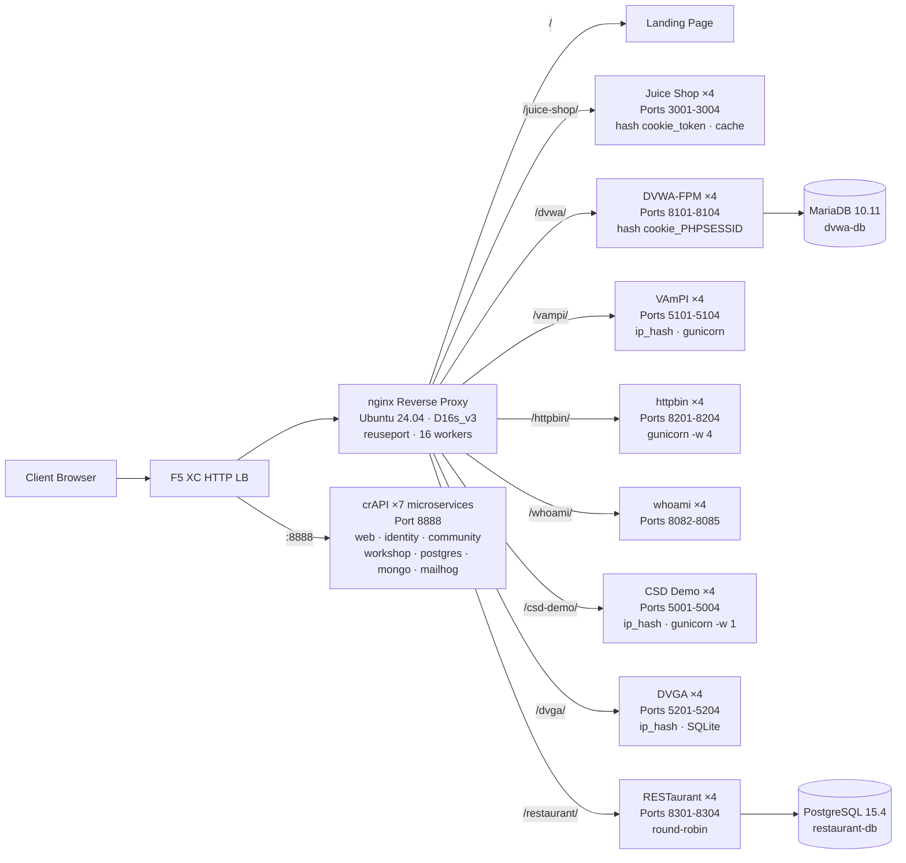

## Zweck

Diese Komponente stellt einen einzelnen Ursprungsserver bereit, der mehrere anfällige Webanwendungen für Sicherheitstest-Demos hostet. Er repräsentiert den „Ursprung" in einer typischen Load-Balancer-Architektur – den Backend-Inhaltsserver, den ein F5 XC HTTP-Load-Balancer schützt.

In Produktionsarchitekturen:

```
End User -> F5 XC HTTP LB (WAF/Bot/API Security) -> Origin Server -> Application
```

Diese Komponente ersetzt einen echten Produktionsanwendungsserver durch eine zweckgebundene VM, auf der bekannte anfällige Anwendungen ausgeführt werden, die WAF-Regeln, API-Sicherheitsrichtlinien und Bot-Erkennung auslösen.

## Architektur



**41 Container** auf einer Standard_D16s_v3-VM (16 vCPU, 64 GiB RAM, 60 GiB Festplatte).

Der nginx-Reverse-Proxy:

- **Lauscht auf Port 80** mit `reuseport` und `backlog=4096` für hochnebenläufigen CDN-Datenverkehr
- **Routet nach Pfadpräfix** zu lastverteilten Upstream-Pools (4 Instanzen pro Anwendung)
- **Sticky Sessions** verhindern Zustandsverlust: `hash $cookie_token` für Juice Shop, `hash $cookie_PHPSESSID` für DVWA, `ip_hash` für VAmPI und CSD Demo (SQLite/In-Memory-Zustand pro Instanz)
- **Proxy-Cache** für statische Juice-Shop-Assets (10-MB-Zone, 100 MB max., 60 s TTL)
- **Zugriffsprotokollierung deaktiviert**, um Erschöpfung des Festplattenspeichers bei CDN-Lasttests zu vermeiden (logrotate als Defense-in-Depth)
- **Leitet Client-Header weiter** (`X-Real-IP`, `X-Forwarded-For`, `X-Forwarded-Proto`) für Ursprungstransparenz
- **Kernel-Tuning** über sysctl: `somaxconn=65535`, `tcp_tw_reuse=1`, `ip_local_port_range=1024-65535`

## Anwendungszuordnung

| Pfad | Upstream | Instanzen | Ports | Sticky Session | Zweck |
|---|---|---|---|---|---|
| `/` | nginx | -- | -- | -- | Startseite mit Links zu allen Anwendungen |
| `/health` | nginx | -- | -- | -- | JSON-Health-Endpunkt (9 Anwendungen aufgeführt) |
| `/juice-shop/` | juice_shop | 4 | 3001-3004 | `hash $cookie_token` | Sicherheit moderner Web-Apps (XSS, Injection, CSRF) |
| `/dvwa/` | dvwa | 4 + MariaDB | 8101-8104 | `hash $cookie_PHPSESSID` | Klassische WAF-Tests mit einstellbarem Schwierigkeitsgrad |
| `/vampi/` | vampi | 4 | 5101-5104 | `ip_hash` | REST-API-Sicherheitstests (OWASP API Top 10) |
| `/httpbin/` | httpbin_up | 4 | 8201-8204 | -- | HTTP-Anfrage-/Antwortdienst für API-Demos |
| `/whoami/` | whoami_up | 4 | 8082-8085 | -- | Anfrage-Diagnose – zeigt alle Header und Client-IP an |
| `/csd-demo/` | csd_demo | 4 | 5001-5004 | `ip_hash` | Clientseitige Abwehr-Tests (Magecart-Angriffe) |
| `/dvga/` | dvga | 4 | 5201-5204 | `ip_hash` | GraphQL-API-Sicherheitstests (Injection, DoS, Auth-Bypass) |
| `/restaurant/` | restaurant | 4 + PostgreSQL | 8301-8304 | -- | REST-API-Sicherheit (OWASP API Top 10 2023) |
| `:8888` | crapi | 7 Microservices | 8888 | -- | OWASP crAPI (BOLA, BFLA, Mass Assignment, SSRF, JWT) |

## Modulares Komponentendesign

Dies ist ein Teil einer größeren Laborumgebung. Jede Komponente ist eigenständig und wird unabhängig bereitgestellt:

- **Diese Komponente** stellt den Ursprungsserver bereit (nginx + Docker-Container auf Azure-VM)
- **CDN-Simulator** stellt die CDN-Edge-Schicht bereit (nginx-Caching auf Azure-VM)
- **Weitere Komponenten** stellen die F5 XC-Konfiguration, DNS, WAF-Richtlinien, API-Sicherheit usw. bereit.

Der menschliche Bediener fügt Komponenten einzeln hinzu. Die Dokumentation jeder Komponente ist so verfasst, dass ein KI-Assistent sie lesen und die Infrastruktur autonom bereitstellen kann.

## Warum diese Anwendungen

| Anwendung | Auswahlgrund |
|---|---|
| **Juice Shop** | OWASP-Flaggschiffprojekt; moderne Node.js-SPA mit über 100 Challenges, die die OWASP Top 10 abdecken; aktiv gepflegt; 4 Instanzen mit Proxy-Cache |
| **DVWA** | Branchenstandard für WAF-Tests; einstellbare Sicherheitsstufen (niedrig/mittel/hoch/unmöglich); benutzerdefinierter php-fpm-+nginx-Build für Performance; gemeinsames MariaDB-10.11-Backend |
| **VAmPI** | Zweckgebaut für OWASP API Security Top 10; REST-API mit bekannten Schwachstellen; gunicorn mit 4 Workern pro Instanz; ip_hash Sticky für SQLite-Konsistenz |
| **httpbin** | Kenneth Reitz' kanonischer HTTP-Testdienst; gunicorn mit 4 gevent-Workern; nützlich für API-Demos und Anfrageninspektion |
| **whoami** | Traefiks Request-Echo-Server; zeigt vollständige Anfragendetails so an, wie der Ursprung sie sieht – unverzichtbar zur Überprüfung der F5 XC-Header-Injektion |
| **CSD Demo** | Benutzerdefinierte Checkout-Seite mit 5 umschaltbaren Magecart-artigen Angriffen (Card Skimmer, Formjacker, Keylogger, Cryptominer, DOM Hijack); Exfil-Endpunkt + Angreifer-Dashboard; gunicorn Single-Worker für In-Memory-Zustandspersistenz |
| **DVGA** | Damn Vulnerable GraphQL Application; GraphQL-spezifische Schwachstellen einschließlich Injection, DoS, Batching-Angriffe und Autorisierungsumgehung; GraphiQL-UI für interaktive Erkundung; ip_hash Sticky für SQLite pro Instanz |
| **RESTaurant** | Damn Vulnerable RESTaurant API Game; zweckgebaut für OWASP API Security Top 10 2023; FastAPI mit Swagger UI; gemeinsames PostgreSQL-15.4-Backend; deckt BOLA, BFLA, Mass Assignment, SSRF und Injection ab |
| **crAPI** | OWASP Completely Ridiculous API; 7-Microservice-Architektur, die BOLA, BFLA, Mass Assignment, SSRF, JWT-Manipulation und NoSQL-Injection abdeckt; dedizierter Port 8888 (SPA mit fest codierten API-Pfaden); MailHog für E-Mail-Erfassung |
