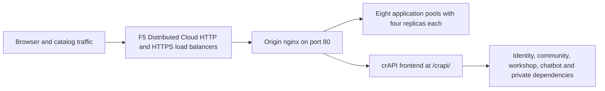
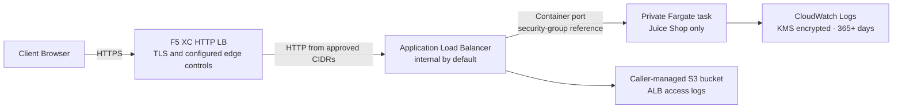

## Purpose

This repository provides two separate origin offerings for authorized F5 Distributed Cloud security demos. Choose the deployment that matches the required application scope and cloud runtime.

| Offering | Application scope | Runtime | Ingress | Terraform source |
| --- | --- | --- | --- | --- |
| **Azure full-origin** | Nine applications across 42 container services | nginx and Docker on an Ubuntu 24.04 Azure VM | nginx on the VM | [`terraform/`](https://github.com/f5-sales-demo/origin-server/tree/main/terraform) |
| **AWS Juice Shop** | OWASP Juice Shop only | Private AWS Fargate tasks | Application Load Balancer, internal by default | [`terraform/modules/aws-juice-shop/`](https://github.com/f5-sales-demo/origin-server/tree/d6384bb0621c4c1eceb38d55a6b63e7b9cc7083a/terraform/modules/aws-juice-shop) |

The AWS offering is not a cloud-equivalent version of the Azure nine-application stack. It does not deploy nginx, DVWA, VAmPI, httpbin, whoami, CSD Demo, DVGA, RESTaurant, or crAPI.

In both designs, F5 Distributed Cloud can provide the public HTTP load balancer and configured edge security controls in front of the origin.

## Azure full-origin architecture

The application inventory is `provisioning/applications.json`; `provisioning/files.json` contains the Compose and nginx inputs. Both the standalone Terraform root and WAAP use the digest-checked `scripts/install-release.sh` and `scripts/install_origin.py`. Guest-only changes are not reproducible installation evidence.

The manifest declares nine applications. Compose declares **42 container services**: 32 replicas for the eight pooled applications, two shared application databases, and eight crAPI services. This is a source inventory, not a live container-health verdict. crAPI uses loopback port 18888 behind nginx and is published at `/crapi/`.

## Azure application mapping

| Application | Published prefix | Replicas | Native loopback ports | Content and workflows |
| --- | --- | --- | --- | --- |
| Juice Shop | `/juice-shop/` | 4 | 3001–3004 | translated-labels, products-and-images, login, basket, supporting-pages, socket-io-affinity |
| DVWA | `/dvwa/` | 4 | 8101–8104 | authenticated-navigation, styles-and-forms, security-settings, seeded-vulnerability-pages |
| VAmPI | `/vampi/` | 4 | 5101–5104 | api-definition, authentication, users, seeded-books |
| HTTPBin | `/httpbin/` | 4 | 8201–8204 | local-swagger-assets, specification, links-and-forms |
| whoami | `/whoami/` | 4 | 8082–8085 | diagnostic-content, proxy-headers |
| CSD Demo | `/csd-demo/` | 4 | 5001–5004 | dashboard, checkout, receiver, counter, clear-log, replica-state |
| DVGA | `/dvga/` | 4 | 5201–5204 | styles-scripts-images, navigation-and-forms, GraphQL, subscriptions, seeded-pastes |
| RESTaurant | `/restaurant/` | 4 | 8301–8304 | swagger, redoc, local-assets, authentication, seeded-roles |
| crAPI | `/crapi/` | 1 | 18888 | login, signup, seeded-vehicle, community, workshop, deep-link-refresh, mailhog |

nginx keeps published assets, redirects, forms, cookies, API definitions and SPA deep links under each prefix.
Juice Shop uses a consistent hash of forwarded client identity (falling back to the remote address), DVWA
hashes the PHP session cookie, VAmPI and CSD Demo use `ip_hash`, and DVGA hashes the replica cookie (falling
back to a request ID). HTTPBin, whoami and RESTaurant use round-robin pools. State is not automatically
interchangeable between every replica: verify each native instance as well as published affinity. DVWA shares
its database and session volume; RESTaurant shares PostgreSQL. CSD state is checked across replicas.

Access logs are disabled in the checked-in nginx configuration. Private structured verification receipts provide evidence. Prefix adapters and the Juice Shop response-framing preload are provisioned from source. VAmPI's root and API definition return JSON; RESTaurant publishes Swagger at `/restaurant/`, ReDoc at `/restaurant/redoc`, and its definition at `/restaurant/openapi.json`.

[Verification](../05-verify/) distinguishes quick health from complete browser and workflow checks. [Application workflows](../application-workflows/) covers synthetic actors and recovery. CSD activity in the WAAP showcase is display-only with `csd_enabled=false`.

## AWS Juice Shop Architecture

The AWS module deploys only OWASP Juice Shop. It creates an ECS cluster, service, task definition, security groups, an Application Load Balancer, and supporting observability and execution-role resources in caller-managed networking.

### Trust Boundary and Exposure

F5 Distributed Cloud is the public HTTPS termination and configured security-enforcement point in this design. The F5 Distributed Cloud-to-ALB hop intentionally uses HTTP and is acceptable only as a documented trusted-routing-domain exception. Restrict ALB port 80 ingress through `allowed_ingress_cidrs` to approved F5 Distributed Cloud egress or connected-network CIDRs.
If that routing domain cannot be trusted and protected from interception, use a different origin design.

The ALB is internal by default (`public_exposure = false`). Internet-facing exposure requires the explicit `public_exposure = true` setting and approved CIDR restrictions; `0.0.0.0/0` is accepted only with that explicit mode and is not recommended.

Fargate tasks run in caller-managed private subnets with no public IP address. Their security group accepts the application port only from the ALB security group. The module creates no SSH ingress or direct public path to a task.

### Security and Operational Controls

- The default Juice Shop image is pinned by immutable SHA-256 digest; upgrades require selecting and reviewing a new digest rather than using a mutable tag.
- CloudWatch container logs use a caller-managed KMS key and enforce at least 365 days of retention.
- ALB access logging is enabled to a caller-managed S3 bucket; the caller owns bucket encryption, lifecycle, public-access blocking, and the regional log-delivery policy.
- ECS Container Insights is enabled.
- The task execution role is scoped to creating log streams and writing log events for this deployment's CloudWatch log group.
- The ECS deployment circuit breaker is enabled with automatic rollback.
- The caller owns the VPC, subnets, routes, egress, KMS key, S3 bucket, AWS provider authentication, and Terraform state.

For the pinned inputs, prerequisites, deployment contract, and verification guidance, see the [AWS Juice Shop module documentation](https://github.com/f5-sales-demo/origin-server/tree/d6384bb0621c4c1eceb38d55a6b63e7b9cc7083a/terraform/modules/aws-juice-shop).

## Modular Component Design

This is one piece of a larger lab environment. Each component is self-contained and deployed independently:

- **Azure full-origin** provides nginx and 42 Docker container services on an Azure VM.
- **AWS Juice Shop** independently provides Juice Shop on private Fargate tasks behind an ALB.
- **CDN Simulator** provides the CDN edge layer (nginx caching on Azure VM)
- **Other components** provide the F5 XC configuration, DNS, WAF policies, API security, etc.

The human operator adds components one at a time. Each component's documentation is written so an AI assistant can read it and deploy the infrastructure autonomously.

## Why the Azure Full-Origin Uses These Applications

| Application | Why Selected |
| --- | --- |
| **Juice Shop** | OWASP flagship project; modern Node.js SPA with 100+ challenges covering the OWASP Top 10; actively maintained; 4 instances with proxy cache |
| **DVWA** | Industry standard for WAF testing; adjustable security levels (low/medium/high/impossible); custom php-fpm + nginx build for performance; shared MariaDB 10.11 backend |
| **VAmPI** | Purpose-built for OWASP API Security Top 10; REST API with known vulnerabilities; gunicorn with 4 workers per instance; ip_hash sticky for SQLite consistency |
| **httpbin** | Kenneth Reitz's canonical HTTP testing service; gunicorn with 4 gevent workers; useful for API demos and request inspection |
| **whoami** | Traefik's request echo server; shows full request details as the origin sees them -- essential for verifying F5 XC header injection |
| **CSD Demo** | Custom checkout page with 5 toggleable Magecart-style attacks (card skimmer, formjacker, keylogger, cryptominer, DOM hijack); exfil endpoint + attacker dashboard; gunicorn single-worker for in-memory state persistence |
| **DVGA** | Damn Vulnerable GraphQL Application; GraphQL-specific vulnerabilities including injection, DoS, batching attacks, and authorization bypass; GraphiQL UI for interactive exploration; ip_hash sticky for SQLite per instance |
| **RESTaurant** | Damn Vulnerable RESTaurant API Game; purpose-built for OWASP API Security Top 10 2023; FastAPI with Swagger UI; shared PostgreSQL 15.4 backend; covers BOLA, BFLA, mass assignment, SSRF, and injection |
| **crAPI** | OWASP Completely Ridiculous API; eight-service architecture covering BOLA, BFLA, mass assignment, SSRF, JWT manipulation, and NoSQL injection; prefix-aware frontend under `/crapi/`; MailHog for email capture |
