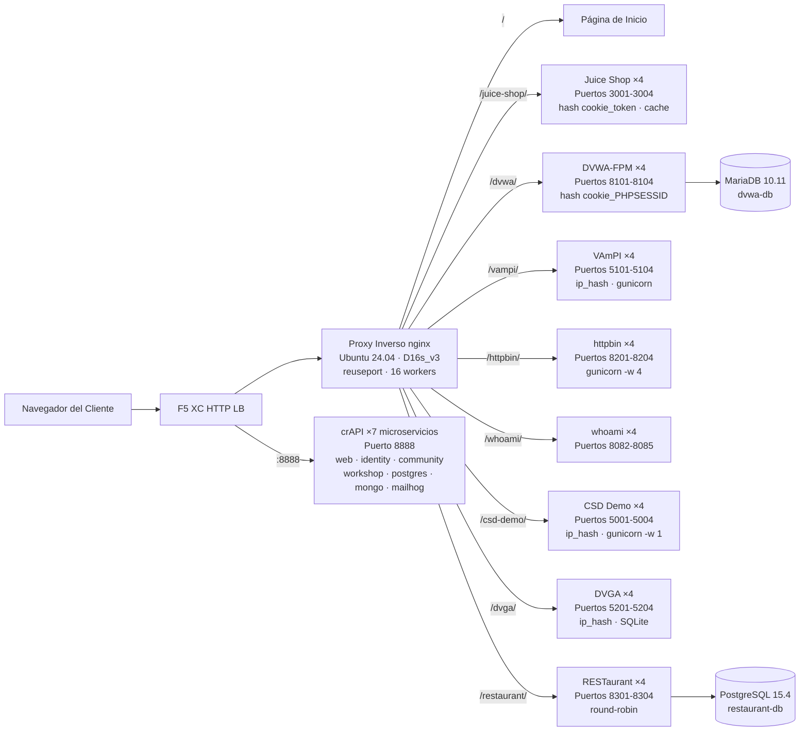

## Propósito

Este componente proporciona un único servidor de origen que aloja múltiples aplicaciones web vulnerables para demostraciones de pruebas de seguridad. Representa el "origen" en una arquitectura típica de balanceador de carga -- el servidor de contenido backend que un balanceador de carga HTTP de F5 XC protege.

En arquitecturas de producción:

```
Usuario Final -> F5 XC HTTP LB (WAF/Bot/Seguridad API) -> Servidor de Origen -> Aplicación
```

Este componente reemplaza un servidor de aplicaciones de producción real con una VM construida específicamente que ejecuta aplicaciones vulnerables conocidas que activan reglas WAF, políticas de seguridad de API y detección de bots.

## Arquitectura



**41 contenedores** en una VM Standard_D16s_v3 (16 vCPU, 64 GiB RAM, 60 GiB disco).

El proxy inverso nginx:

- **Escucha en el puerto 80** con `reuseport` y `backlog=4096` para tráfico CDN de alta concurrencia
- **Enruta por prefijo de ruta** a pools upstream balanceados (4 instancias por aplicación)
- **Sesiones persistentes** previenen la pérdida de estado: `hash $cookie_token` para Juice Shop, `hash $cookie_PHPSESSID` para DVWA, `ip_hash` para VAmPI y CSD Demo (estado SQLite/en memoria por instancia)
- **Caché de proxy** para activos estáticos de Juice Shop (zona de 10 MB, máximo 100 MB, TTL de 60 s)
- **Registro de acceso deshabilitado** para prevenir el agotamiento del disco bajo pruebas de carga CDN (logrotate como defensa en profundidad)
- **Pasa encabezados del cliente** (`X-Real-IP`, `X-Forwarded-For`, `X-Forwarded-Proto`) para visibilidad del origen
- **Ajuste del kernel** vía sysctl: `somaxconn=65535`, `tcp_tw_reuse=1`, `ip_local_port_range=1024-65535`

## Mapeo de Aplicaciones

| Ruta | Upstream | Instancias | Puertos | Sesión Persistente | Propósito |
|---|---|---|---|---|---|
| `/` | nginx | -- | -- | -- | Página de inicio con enlaces a todas las apps |
| `/health` | nginx | -- | -- | -- | Endpoint de salud JSON (9 apps listadas) |
| `/juice-shop/` | juice_shop | 4 | 3001-3004 | `hash $cookie_token` | Seguridad de app web moderna (XSS, inyección, CSRF) |
| `/dvwa/` | dvwa | 4 + MariaDB | 8101-8104 | `hash $cookie_PHPSESSID` | Pruebas WAF clásicas con dificultad ajustable |
| `/vampi/` | vampi | 4 | 5101-5104 | `ip_hash` | Pruebas de seguridad de API REST (OWASP API Top 10) |
| `/httpbin/` | httpbin_up | 4 | 8201-8204 | -- | Servicio de solicitud/respuesta HTTP para demos de API |
| `/whoami/` | whoami_up | 4 | 8082-8085 | -- | Diagnóstico de solicitudes -- muestra todos los encabezados, IP del cliente |
| `/csd-demo/` | csd_demo | 4 | 5001-5004 | `ip_hash` | Pruebas de Defensa del Lado del Cliente (ataques Magecart) |
| `/dvga/` | dvga | 4 | 5201-5204 | `ip_hash` | Pruebas de seguridad de API GraphQL (inyección, DoS, bypass de autenticación) |
| `/restaurant/` | restaurant | 4 + PostgreSQL | 8301-8304 | -- | Seguridad de API REST (OWASP API Top 10 2023) |
| `:8888` | crapi | 7 microservicios | 8888 | -- | OWASP crAPI (BOLA, BFLA, asignación masiva, SSRF, JWT) |

## Diseño Modular de Componentes

Este es una pieza de un entorno de laboratorio más amplio. Cada componente es autónomo y se despliega de forma independiente:

- **Este componente** proporciona el servidor de origen (nginx + contenedores Docker en VM de Azure)
- **Simulador CDN** proporciona la capa edge del CDN (caché nginx en VM de Azure)
- **Otros componentes** proporcionan la configuración de F5 XC, DNS, políticas WAF, seguridad de API, etc.

El operador humano añade componentes uno a la vez. La documentación de cada componente está escrita para que un asistente de IA pueda leerla y desplegar la infraestructura de forma autónoma.

## Por Qué Estas Aplicaciones

| Aplicación | Por Qué Fue Seleccionada |
|---|---|
| **Juice Shop** | Proyecto insignia de OWASP; SPA moderna en Node.js con más de 100 desafíos que cubren el OWASP Top 10; mantenida activamente; 4 instancias con caché de proxy |
| **DVWA** | Estándar de la industria para pruebas WAF; niveles de seguridad ajustables (bajo/medio/alto/imposible); compilación personalizada de php-fpm + nginx para rendimiento; backend compartido MariaDB 10.11 |
| **VAmPI** | Construida específicamente para OWASP API Security Top 10; API REST con vulnerabilidades conocidas; gunicorn con 4 workers por instancia; ip_hash sticky para consistencia de SQLite |
| **httpbin** | Servicio canónico de pruebas HTTP de Kenneth Reitz; gunicorn con 4 workers gevent; útil para demos de API e inspección de solicitudes |
| **whoami** | Servidor de eco de solicitudes de Traefik; muestra los detalles completos de la solicitud tal como los ve el origen -- esencial para verificar la inyección de encabezados de F5 XC |
| **CSD Demo** | Página de checkout personalizada con 5 ataques estilo Magecart activables (skimmer de tarjetas, formjacker, keylogger, criptominero, secuestro de DOM); endpoint de exfiltración + panel del atacante; gunicorn single-worker para persistencia de estado en memoria |
| **DVGA** | Damn Vulnerable GraphQL Application; vulnerabilidades específicas de GraphQL incluyendo inyección, DoS, ataques de batching y bypass de autorización; interfaz GraphiQL para exploración interactiva; ip_hash sticky para SQLite por instancia |
| **RESTaurant** | Damn Vulnerable RESTaurant API Game; construida específicamente para OWASP API Security Top 10 2023; FastAPI con Swagger UI; backend compartido PostgreSQL 15.4; cubre BOLA, BFLA, asignación masiva, SSRF e inyección |
| **crAPI** | OWASP Completely Ridiculous API; arquitectura de 7 microservicios que cubre BOLA, BFLA, asignación masiva, SSRF, manipulación de JWT e inyección NoSQL; puerto dedicado 8888 (SPA con rutas de API codificadas); MailHog para captura de correo electrónico |
