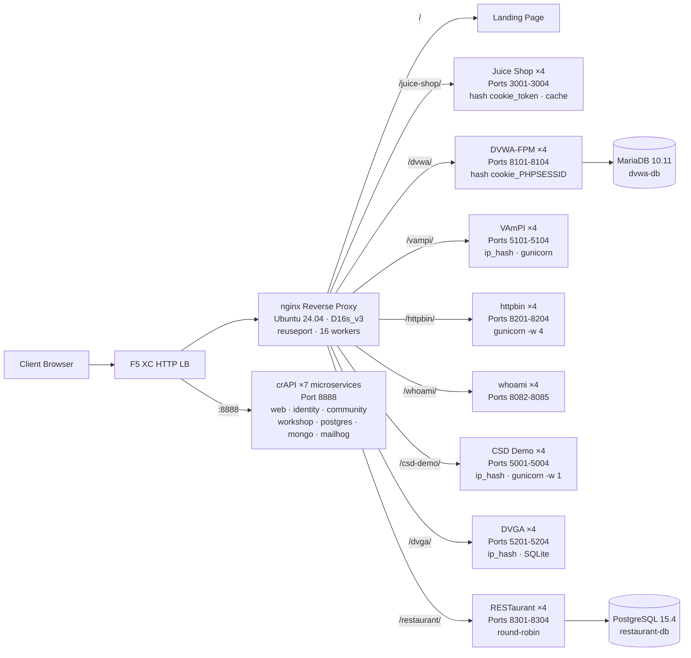

## Propósito

Este componente proporciona un único Servidor de origen que aloja múltiples aplicaciones web vulnerables para demostraciones de pruebas de seguridad. Representa el "origen" en una arquitectura típica de balanceador de carga: el servidor de contenido backend que un balanceador de carga HTTP de F5 XC protege.

En arquitecturas de producción:

```
End User -> F5 XC HTTP LB (WAF/Bot/API Security) -> Origin Server -> Application
```

Este componente reemplaza un servidor de aplicaciones de producción real con una VM de propósito específico que ejecuta aplicaciones vulnerables conocidas que activan reglas de Firewall de aplicaciones web (WAF), políticas de Seguridad de API y detección de bots.

## Arquitectura



**41 contenedores** en una VM Standard_D16s_v3 (16 vCPU, 64 GiB RAM, 60 GiB de disco).

El proxy inverso nginx:

- **Escucha en el puerto 80** con `reuseport` y `backlog=4096` para tráfico CDN de alta concurrencia
- **Enruta por prefijo de ruta** hacia grupos de servidores upstream con balanceo de carga (4 instancias por aplicación)
- **Las sesiones sticky** evitan la pérdida de estado: `hash $cookie_token` para Juice Shop, `hash $cookie_PHPSESSID` para DVWA, `ip_hash` para VAmPI y CSD Demo (estado SQLite/en memoria por instancia)
- **Caché de proxy** para activos estáticos de Juice Shop (zona de 10 MB, máximo 100 MB, TTL de 60 s)
- **Registro de acceso deshabilitado** para evitar el agotamiento del disco bajo pruebas de carga CDN (logrotate como defensa en profundidad)
- **Reenvío de cabeceras del cliente** (`X-Real-IP`, `X-Forwarded-For`, `X-Forwarded-Proto`) para visibilidad en el origen
- **Ajuste del kernel** mediante sysctl: `somaxconn=65535`, `tcp_tw_reuse=1`, `ip_local_port_range=1024-65535`

## Mapeo de aplicaciones

| Ruta | Upstream | Instancias | Puertos | Sesión sticky | Propósito |
|---|---|---|---|---|---|
| `/` | nginx | -- | -- | -- | Página de inicio con enlaces a todas las aplicaciones |
| `/health` | nginx | -- | -- | -- | Endpoint de salud JSON (9 aplicaciones listadas) |
| `/juice-shop/` | juice_shop | 4 | 3001-3004 | `hash $cookie_token` | Seguridad de aplicaciones web modernas (XSS, inyección, CSRF) |
| `/dvwa/` | dvwa | 4 + MariaDB | 8101-8104 | `hash $cookie_PHPSESSID` | Pruebas clásicas de Firewall de aplicaciones web (WAF) con dificultad ajustable |
| `/vampi/` | vampi | 4 | 5101-5104 | `ip_hash` | Pruebas de seguridad de API REST (OWASP API Top 10) |
| `/httpbin/` | httpbin_up | 4 | 8201-8204 | -- | Servicio de solicitud/respuesta HTTP para demostraciones de API |
| `/whoami/` | whoami_up | 4 | 8082-8085 | -- | Diagnósticos de solicitudes — muestra todas las cabeceras y la IP del cliente |
| `/csd-demo/` | csd_demo | 4 | 5001-5004 | `ip_hash` | Pruebas de Defensa del lado del cliente (ataques Magecart) |
| `/dvga/` | dvga | 4 | 5201-5204 | `ip_hash` | Pruebas de seguridad de API GraphQL (inyección, DoS, omisión de autenticación) |
| `/restaurant/` | restaurant | 4 + PostgreSQL | 8301-8304 | -- | Seguridad de API REST (OWASP API Top 10 2023) |
| `:8888` | crapi | 7 microservicios | 8888 | -- | OWASP crAPI (BOLA, BFLA, asignación masiva, SSRF, JWT) |

## Diseño de componentes modulares

Este es uno de los elementos de un entorno de laboratorio más amplio. Cada componente es autocontenido y se implementa de forma independiente:

- **Este componente** proporciona el Servidor de origen (nginx + contenedores Docker en una VM de Azure)
- **El Simulador CDN** proporciona la capa de borde CDN (caché nginx en una VM de Azure)
- **Otros componentes** proporcionan la configuración de F5 XC, DNS, políticas de Firewall de aplicaciones web (WAF), Seguridad de API, etc.

El operador humano añade componentes de uno en uno. La documentación de cada componente está redactada de modo que un asistente de IA pueda leerla e implementar la infraestructura de forma autónoma.

## Por qué estas aplicaciones

| Aplicación | Motivo de selección |
|---|---|
| **Juice Shop** | Proyecto insignia de OWASP; SPA Node.js moderno con más de 100 desafíos que cubren el OWASP Top 10; mantenimiento activo; 4 instancias con caché de proxy |
| **DVWA** | Estándar de la industria para pruebas de Firewall de aplicaciones web (WAF); niveles de seguridad ajustables (bajo/medio/alto/imposible); compilación personalizada de php-fpm + nginx para rendimiento; backend MariaDB 10.11 compartido |
| **VAmPI** | Diseñado específicamente para el OWASP API Security Top 10; API REST con vulnerabilidades conocidas; gunicorn con 4 workers por instancia; sticky ip_hash para consistencia con SQLite |
| **httpbin** | Servicio canónico de pruebas HTTP de Kenneth Reitz; gunicorn con 4 workers gevent; útil para demostraciones de API e inspección de solicitudes |
| **whoami** | Servidor de eco de solicitudes de Traefik; muestra los detalles completos de la solicitud tal como los ve el origen — esencial para verificar la inyección de cabeceras de F5 XC |
| **CSD Demo** | Página de pago personalizada con 5 ataques de estilo Magecart activables (skimmer de tarjetas, formjacker, keylogger, criptominero, secuestro DOM); endpoint de exfiltración + panel del atacante; gunicorn de un solo worker para persistencia del estado en memoria |
| **DVGA** | Damn Vulnerable GraphQL Application; vulnerabilidades específicas de GraphQL que incluyen inyección, DoS, ataques de batching y omisión de autorización; UI GraphiQL para exploración interactiva; sticky ip_hash para SQLite por instancia |
| **RESTaurant** | Damn Vulnerable RESTaurant API Game; diseñado específicamente para el OWASP API Security Top 10 2023; FastAPI con Swagger UI; backend PostgreSQL 15.4 compartido; cubre BOLA, BFLA, asignación masiva, SSRF e inyección |
| **crAPI** | OWASP Completely Ridiculous API; arquitectura de 7 microservicios que cubre BOLA, BFLA, asignación masiva, SSRF, manipulación de JWT e inyección NoSQL; puerto dedicado 8888 (SPA con rutas de API codificadas); MailHog para captura de correo electrónico |
