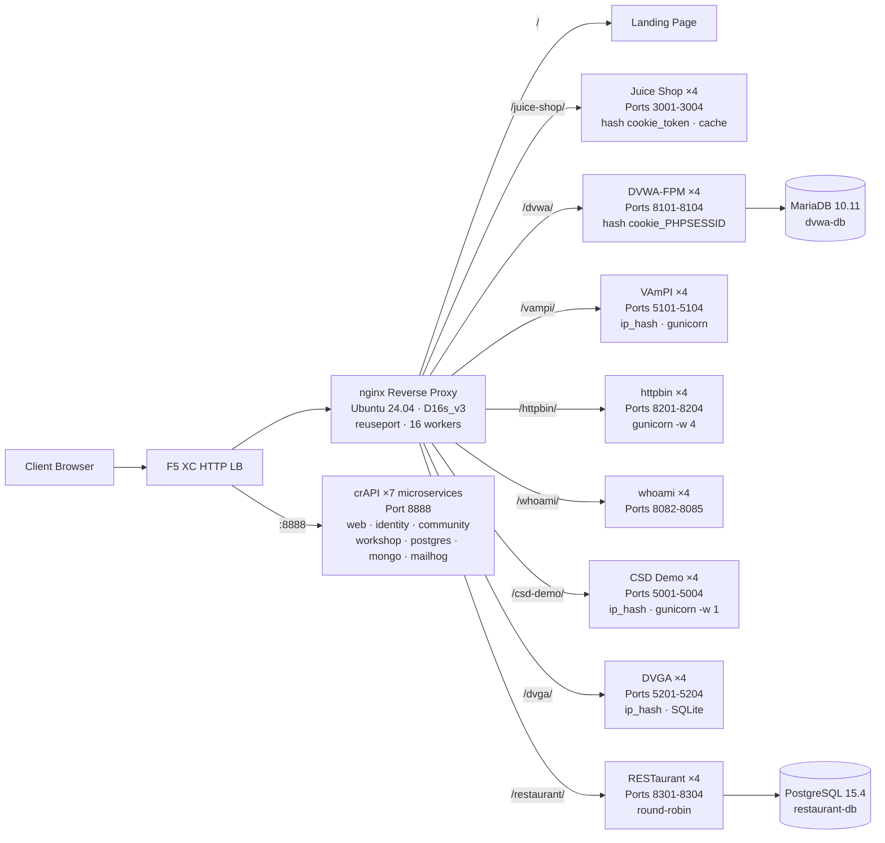

## Objectif

Ce composant fournit un serveur d'origine unique hébergeant plusieurs applications web vulnérables pour les démonstrations de tests de sécurité. Il représente l'« origine » dans une architecture typique de répartiteur de charge -- le serveur de contenu backend qu'un répartiteur de charge HTTP F5 XC protège.

Dans les architectures de production :

```
End User -> F5 XC HTTP LB (WAF/Bot/API Security) -> Origin Server -> Application
```

Ce composant remplace un véritable serveur d'application de production par une VM spécialement conçue exécutant des applications vulnérables bien connues qui déclenchent des règles WAF, des politiques de sécurité API et la détection de bots.

## Architecture



**41 conteneurs** sur une VM Standard_D16s_v3 (16 vCPU, 64 Gio de RAM, 60 Gio de disque).

Le proxy inverse nginx :

- **Écoute sur le port 80** avec `reuseport` et `backlog=4096` pour le trafic CDN à haute concurrence
- **Route par préfixe de chemin** vers des pools upstream à charge répartie (4 instances par application)
- **Sessions persistantes** pour éviter la perte d'état : `hash $cookie_token` pour Juice Shop, `hash $cookie_PHPSESSID` pour DVWA, `ip_hash` pour VAmPI et CSD Demo (état SQLite/en mémoire par instance)
- **Cache proxy** pour les ressources statiques de Juice Shop (zone de 10 Mo, maximum de 100 Mo, TTL de 60 s)
- **Journalisation d'accès désactivée** pour éviter l'épuisement du disque lors des tests de charge CDN (logrotate en défense en profondeur)
- **Transmet les en-têtes client** (`X-Real-IP`, `X-Forwarded-For`, `X-Forwarded-Proto`) pour la visibilité de l'origine
- **Optimisation du noyau** via sysctl : `somaxconn=65535`, `tcp_tw_reuse=1`, `ip_local_port_range=1024-65535`

## Correspondance des applications

| Chemin | Upstream | Instances | Ports | Session persistante | Objectif |
|---|---|---|---|---|---|
| `/` | nginx | -- | -- | -- | Page d'accueil avec liens vers toutes les applications |
| `/health` | nginx | -- | -- | -- | Point de terminaison de santé JSON (9 applications listées) |
| `/juice-shop/` | juice_shop | 4 | 3001-3004 | `hash $cookie_token` | Sécurité des applications web modernes (XSS, injection, CSRF) |
| `/dvwa/` | dvwa | 4 + MariaDB | 8101-8104 | `hash $cookie_PHPSESSID` | Tests WAF classiques avec difficulté ajustable |
| `/vampi/` | vampi | 4 | 5101-5104 | `ip_hash` | Tests de sécurité des API REST (OWASP API Top 10) |
| `/httpbin/` | httpbin_up | 4 | 8201-8204 | -- | Service de requête/réponse HTTP pour les démos API |
| `/whoami/` | whoami_up | 4 | 8082-8085 | -- | Diagnostics de requête -- affiche tous les en-têtes, IP client |
| `/csd-demo/` | csd_demo | 4 | 5001-5004 | `ip_hash` | Tests de défense côté client (attaques Magecart) |
| `/dvga/` | dvga | 4 | 5201-5204 | `ip_hash` | Tests de sécurité des API GraphQL (injection, DoS, contournement d'authentification) |
| `/restaurant/` | restaurant | 4 + PostgreSQL | 8301-8304 | -- | Sécurité des API REST (OWASP API Top 10 2023) |
| `:8888` | crapi | 7 microservices | 8888 | -- | OWASP crAPI (BOLA, BFLA, affectation de masse, SSRF, JWT) |

## Conception modulaire des composants

Il s'agit d'un élément d'un environnement de laboratoire plus vaste. Chaque composant est autonome et déployé indépendamment :

- **Ce composant** fournit le serveur d'origine (nginx + conteneurs Docker sur une VM Azure)
- **Le simulateur CDN** fournit la couche périphérique CDN (mise en cache nginx sur une VM Azure)
- **Les autres composants** fournissent la configuration F5 XC, le DNS, les politiques WAF, la sécurité API, etc.

L'opérateur humain ajoute les composants un par un. La documentation de chaque composant est rédigée de sorte qu'un assistant IA puisse la lire et déployer l'infrastructure de manière autonome.

## Pourquoi ces applications

| Application | Raison de la sélection |
|---|---|
| **Juice Shop** | Projet phare de l'OWASP ; SPA Node.js moderne avec plus de 100 défis couvrant le Top 10 OWASP ; activement maintenu ; 4 instances avec cache proxy |
| **DVWA** | Standard de l'industrie pour les tests WAF ; niveaux de sécurité ajustables (low/medium/high/impossible) ; build personnalisé php-fpm + nginx pour la performance ; backend partagé MariaDB 10.11 |
| **VAmPI** | Conçu spécifiquement pour le Top 10 de la sécurité des API OWASP ; API REST avec des vulnérabilités connues ; gunicorn avec 4 workers par instance ; sessions persistantes ip_hash pour la cohérence SQLite |
| **httpbin** | Service canonique de test HTTP de Kenneth Reitz ; gunicorn avec 4 workers gevent ; utile pour les démos API et l'inspection des requêtes |
| **whoami** | Serveur d'écho de requêtes de Traefik ; affiche les détails complets de la requête tels que l'origine les voit -- essentiel pour vérifier l'injection d'en-têtes F5 XC |
| **CSD Demo** | Page de paiement personnalisée avec 5 attaques de type Magecart activables/désactivables (skimmer de carte, formjacker, keylogger, cryptominer, détournement DOM) ; point de terminaison d'exfiltration + tableau de bord attaquant ; gunicorn single-worker pour la persistance de l'état en mémoire |
| **DVGA** | Damn Vulnerable GraphQL Application ; vulnérabilités spécifiques à GraphQL incluant injection, DoS, attaques par lots et contournement d'autorisation ; interface GraphiQL pour l'exploration interactive ; sessions persistantes ip_hash pour SQLite par instance |
| **RESTaurant** | Damn Vulnerable RESTaurant API Game ; conçu spécifiquement pour le Top 10 de la sécurité des API OWASP 2023 ; FastAPI avec interface Swagger ; backend partagé PostgreSQL 15.4 ; couvre BOLA, BFLA, affectation de masse, SSRF et injection |
| **crAPI** | OWASP Completely Ridiculous API ; architecture à 7 microservices couvrant BOLA, BFLA, affectation de masse, SSRF, manipulation JWT et injection NoSQL ; port dédié 8888 (SPA avec chemins API codés en dur) ; MailHog pour la capture d'e-mails |
