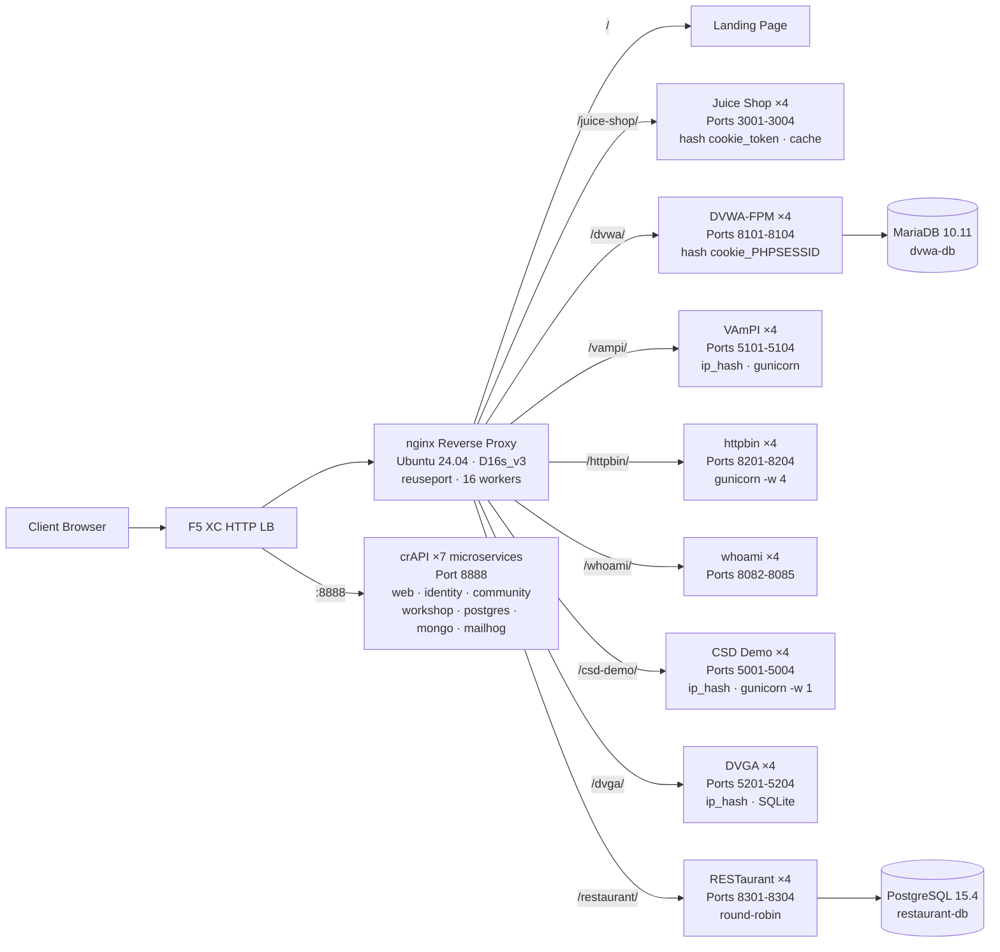

## उद्देश्य

यह घटक सुरक्षा परीक्षण डेमो के लिए कई कमज़ोर वेब एप्लिकेशन होस्ट करने वाला एक एकल ऑरिजिन सर्वर प्रदान करता है। यह एक विशिष्ट लोड बैलेंसर आर्किटेक्चर में "ऑरिजिन" का प्रतिनिधित्व करता है — वह बैकएंड कंटेंट सर्वर जिसे F5 XC HTTP लोड बैलेंसर सुरक्षित करता है।

प्रोडक्शन आर्किटेक्चर में:

```
End User -> F5 XC HTTP LB (WAF/Bot/API Security) -> Origin Server -> Application
```

यह घटक एक वास्तविक प्रोडक्शन एप्लिकेशन सर्वर की जगह एक उद्देश्य-निर्मित VM से लेता है जो जाने-माने कमज़ोर एप्लिकेशन चलाता है जो WAF नियमों, API सुरक्षा नीतियों, और बॉट डिटेक्शन को ट्रिगर करते हैं।

## आर्किटेक्चर



**41 कंटेनर** एक Standard_D16s_v3 VM (16 vCPU, 64 GiB RAM, 60 GiB डिस्क) पर।

nginx रिवर्स प्रॉक्सी:

- **पोर्ट 80 पर सुनती है** `reuseport` और `backlog=4096` के साथ उच्च-कंकरेंसी CDN ट्रैफ़िक के लिए
- **पाथ प्रीफ़िक्स द्वारा रूट करती है** लोड-बैलेंस्ड अपस्ट्रीम पूल में (प्रति एप्लिकेशन 4 इंस्टेंस)
- **Sticky sessions** स्टेट लॉस को रोकती हैं: Juice Shop के लिए `hash $cookie_token`, DVWA के लिए `hash $cookie_PHPSESSID`, VAmPI और CSD Demo के लिए `ip_hash` (SQLite/इन-मेमोरी स्टेट प्रति इंस्टेंस)
- **Proxy cache** Juice Shop स्टैटिक एसेट के लिए (10 MB ज़ोन, 100 MB अधिकतम, 60 s TTL)
- **एक्सेस लॉगिंग अक्षम** CDN लोड परीक्षण के दौरान डिस्क समाप्ति को रोकने के लिए (logrotate डिफेंस-इन-डेप्थ के रूप में)
- **क्लाइंट हेडर पास करती है** (`X-Real-IP`, `X-Forwarded-For`, `X-Forwarded-Proto`) ऑरिजिन विज़िबिलिटी के लिए
- **Kernel tuning** sysctl के माध्यम से: `somaxconn=65535`, `tcp_tw_reuse=1`, `ip_local_port_range=1024-65535`

## एप्लिकेशन मैपिंग

| पाथ | अपस्ट्रीम | इंस्टेंस | पोर्ट | Sticky Session | उद्देश्य |
|---|---|---|---|---|---|
| `/` | nginx | -- | -- | -- | सभी ऐप के लिंक सहित लैंडिंग पेज |
| `/health` | nginx | -- | -- | -- | JSON हेल्थ एंडपॉइंट (9 ऐप सूचीबद्ध) |
| `/juice-shop/` | juice_shop | 4 | 3001-3004 | `hash $cookie_token` | आधुनिक वेब ऐप सुरक्षा (XSS, injection, CSRF) |
| `/dvwa/` | dvwa | 4 + MariaDB | 8101-8104 | `hash $cookie_PHPSESSID` | समायोज्य कठिनाई के साथ क्लासिक WAF परीक्षण |
| `/vampi/` | vampi | 4 | 5101-5104 | `ip_hash` | REST API सुरक्षा परीक्षण (OWASP API Top 10) |
| `/httpbin/` | httpbin_up | 4 | 8201-8204 | -- | API डेमो के लिए HTTP अनुरोध/प्रतिक्रिया सेवा |
| `/whoami/` | whoami_up | 4 | 8082-8085 | -- | अनुरोध डायग्नोस्टिक्स — सभी हेडर, क्लाइंट IP दिखाता है |
| `/csd-demo/` | csd_demo | 4 | 5001-5004 | `ip_hash` | क्लाइंट-साइड डिफेंस परीक्षण (Magecart हमले) |
| `/dvga/` | dvga | 4 | 5201-5204 | `ip_hash` | GraphQL API सुरक्षा परीक्षण (injection, DoS, auth bypass) |
| `/restaurant/` | restaurant | 4 + PostgreSQL | 8301-8304 | -- | REST API सुरक्षा (OWASP API Top 10 2023) |
| `:8888` | crapi | 7 microservices | 8888 | -- | OWASP crAPI (BOLA, BFLA, mass assignment, SSRF, JWT) |

## मॉड्यूलर घटक डिज़ाइन

यह एक बड़े लैब वातावरण का एक हिस्सा है। प्रत्येक घटक स्व-निहित है और स्वतंत्र रूप से डिप्लॉय किया जाता है:

- **यह घटक** ऑरिजिन सर्वर प्रदान करता है (Azure VM पर nginx + Docker कंटेनर)
- **CDN सिम्युलेटर** CDN एज लेयर प्रदान करता है (Azure VM पर nginx कैशिंग)
- **अन्य घटक** F5 XC कॉन्फ़िगरेशन, DNS, WAF नीतियाँ, API सुरक्षा आदि प्रदान करते हैं

मानव ऑपरेटर एक समय में एक-एक घटक जोड़ता है। प्रत्येक घटक का दस्तावेज़ीकरण इस प्रकार लिखा गया है कि एक AI सहायक उसे पढ़कर स्वायत्त रूप से इंफ्रास्ट्रक्चर डिप्लॉय कर सके।

## ये एप्लिकेशन क्यों

| एप्लिकेशन | चयन का कारण |
|---|---|
| **Juice Shop** | OWASP फ्लैगशिप प्रोजेक्ट; OWASP Top 10 को कवर करने वाले 100+ चैलेंज के साथ आधुनिक Node.js SPA; सक्रिय रूप से मेंटेन किया गया; proxy cache के साथ 4 इंस्टेंस |
| **DVWA** | WAF परीक्षण के लिए उद्योग मानक; समायोज्य सुरक्षा स्तर (low/medium/high/impossible); प्रदर्शन के लिए कस्टम php-fpm + nginx बिल्ड; साझा MariaDB 10.11 बैकएंड |
| **VAmPI** | OWASP API सुरक्षा Top 10 के लिए उद्देश्य-निर्मित; ज्ञात कमज़ोरियों के साथ REST API; प्रति इंस्टेंस 4 workers के साथ gunicorn; SQLite स्थिरता के लिए ip_hash sticky |
| **httpbin** | Kenneth Reitz की कैनोनिकल HTTP परीक्षण सेवा; 4 gevent workers के साथ gunicorn; API डेमो और अनुरोध निरीक्षण के लिए उपयोगी |
| **whoami** | Traefik का रिक्वेस्ट इको सर्वर; ऑरिजिन के दृष्टिकोण से पूर्ण अनुरोध विवरण दिखाता है — F5 XC हेडर इंजेक्शन सत्यापित करने के लिए आवश्यक |
| **CSD Demo** | 5 टॉगलेबल Magecart-स्टाइल हमलों (card skimmer, formjacker, keylogger, cryptominer, DOM hijack) के साथ कस्टम चेकआउट पेज; exfil एंडपॉइंट + अटैकर डैशबोर्ड; इन-मेमोरी स्टेट पर्सिस्टेंस के लिए gunicorn सिंगल-वर्कर |
| **DVGA** | Damn Vulnerable GraphQL Application; injection, DoS, batching attacks, और authorization bypass सहित GraphQL-विशिष्ट कमज़ोरियाँ; इंटरएक्टिव एक्सप्लोरेशन के लिए GraphiQL UI; प्रति इंस्टेंस SQLite के लिए ip_hash sticky |
| **RESTaurant** | Damn Vulnerable RESTaurant API Game; OWASP API सुरक्षा Top 10 2023 के लिए उद्देश्य-निर्मित; Swagger UI के साथ FastAPI; साझा PostgreSQL 15.4 बैकएंड; BOLA, BFLA, mass assignment, SSRF, और injection को कवर करता है |
| **crAPI** | OWASP Completely Ridiculous API; BOLA, BFLA, mass assignment, SSRF, JWT manipulation, और NoSQL injection को कवर करने वाला 7-माइक्रोसर्विस आर्किटेक्चर; डेडिकेटेड पोर्ट 8888 (हार्डकोडेड API पाथ के साथ SPA); ईमेल कैप्चर के लिए MailHog |
