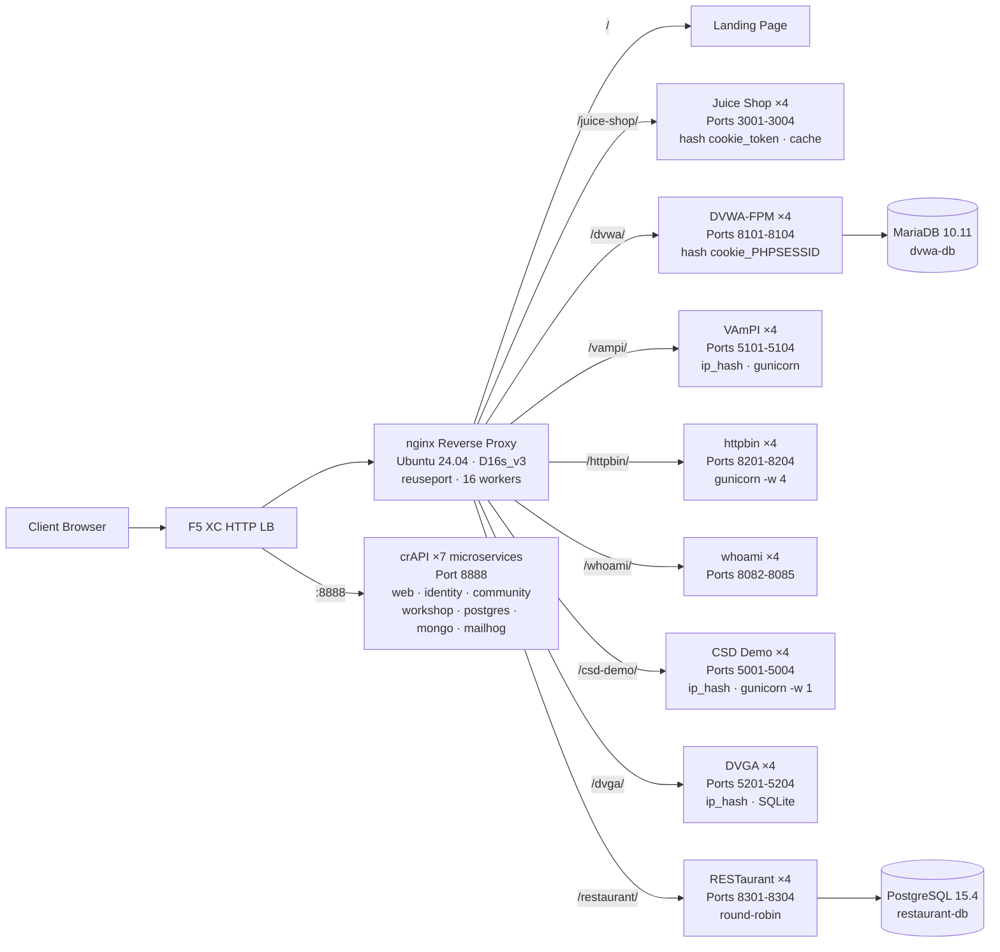

## Scopo

Questo componente fornisce un singolo server di origine che ospita più applicazioni web vulnerabili per demo di test di sicurezza. Rappresenta l'"origine" in una tipica architettura con load balancer -- il server di contenuti backend che un HTTP load balancer F5 XC protegge.

Nelle architetture di produzione:

```
Utente finale -> F5 XC HTTP LB (WAF/Bot/Sicurezza API) -> Server di origine -> Applicazione
```

Questo componente sostituisce un server applicativo di produzione reale con una VM appositamente configurata che esegue applicazioni vulnerabili note, le quali attivano regole WAF, policy di sicurezza API e rilevamento bot.

## Architettura



**41 container** su una VM Standard_D16s_v3 (16 vCPU, 64 GiB RAM, 60 GiB disco).

Il reverse proxy nginx:

- **È in ascolto sulla porta 80** con `reuseport` e `backlog=4096` per il traffico CDN ad alta concorrenza
- **Instrada per prefisso di percorso** verso pool upstream con bilanciamento del carico (4 istanze per applicazione)
- **Le sessioni sticky** prevengono la perdita di stato: `hash $cookie_token` per Juice Shop, `hash $cookie_PHPSESSID` per DVWA, `ip_hash` per VAmPI e CSD Demo (stato SQLite/in-memory per istanza)
- **Proxy cache** per gli asset statici di Juice Shop (zona da 10 MB, massimo 100 MB, TTL 60 s)
- **Logging degli accessi disabilitato** per prevenire l'esaurimento del disco durante i test di carico CDN (logrotate come difesa in profondità)
- **Trasmette gli header del client** (`X-Real-IP`, `X-Forwarded-For`, `X-Forwarded-Proto`) per la visibilità dell'origine
- **Ottimizzazione del kernel** tramite sysctl: `somaxconn=65535`, `tcp_tw_reuse=1`, `ip_local_port_range=1024-65535`

## Mappatura delle applicazioni

| Percorso | Upstream | Istanze | Porte | Sessione sticky | Scopo |
|---|---|---|---|---|---|
| `/` | nginx | -- | -- | -- | Pagina di destinazione con collegamenti a tutte le app |
| `/health` | nginx | -- | -- | -- | Endpoint di salute JSON (9 app elencate) |
| `/juice-shop/` | juice_shop | 4 | 3001-3004 | `hash $cookie_token` | Sicurezza delle applicazioni web moderne (XSS, injection, CSRF) |
| `/dvwa/` | dvwa | 4 + MariaDB | 8101-8104 | `hash $cookie_PHPSESSID` | Test WAF classico con difficoltà regolabile |
| `/vampi/` | vampi | 4 | 5101-5104 | `ip_hash` | Test di sicurezza REST API (OWASP API Top 10) |
| `/httpbin/` | httpbin_up | 4 | 8201-8204 | -- | Servizio di richiesta/risposta HTTP per demo API |
| `/whoami/` | whoami_up | 4 | 8082-8085 | -- | Diagnostica delle richieste -- mostra tutti gli header e l'IP del client |
| `/csd-demo/` | csd_demo | 4 | 5001-5004 | `ip_hash` | Test di Difesa lato client (attacchi Magecart) |
| `/dvga/` | dvga | 4 | 5201-5204 | `ip_hash` | Test di sicurezza API GraphQL (injection, DoS, bypass autenticazione) |
| `/restaurant/` | restaurant | 4 + PostgreSQL | 8301-8304 | -- | Sicurezza REST API (OWASP API Top 10 2023) |
| `:8888` | crapi | 7 microservizi | 8888 | -- | OWASP crAPI (BOLA, BFLA, mass assignment, SSRF, JWT) |

## Design a Componenti Modulari

Questo è un elemento di un ambiente lab più ampio. Ogni componente è autonomo e distribuito in modo indipendente:

- **Questo componente** fornisce il server di origine (nginx + container Docker su VM Azure)
- **Il Simulatore CDN** fornisce lo strato edge CDN (nginx con caching su VM Azure)
- **Gli altri componenti** forniscono la configurazione F5 XC, DNS, policy WAF, sicurezza API, ecc.

L'operatore umano aggiunge i componenti uno alla volta. La documentazione di ciascun componente è scritta in modo che un assistente IA possa leggerla e distribuire l'infrastruttura in modo autonomo.

## Perché queste applicazioni

| Applicazione | Motivo della scelta |
|---|---|
| **Juice Shop** | Progetto di punta OWASP; SPA Node.js moderna con oltre 100 sfide che coprono l'OWASP Top 10; attivamente mantenuto; 4 istanze con proxy cache |
| **DVWA** | Standard del settore per i test WAF; livelli di sicurezza regolabili (basso/medio/alto/impossibile); build personalizzata php-fpm + nginx per le prestazioni; backend MariaDB 10.11 condiviso |
| **VAmPI** | Progettato appositamente per OWASP API Security Top 10; REST API con vulnerabilità note; gunicorn con 4 worker per istanza; sticky ip_hash per la coerenza di SQLite |
| **httpbin** | Servizio canonico di test HTTP di Kenneth Reitz; gunicorn con 4 worker gevent; utile per demo API e ispezione delle richieste |
| **whoami** | Server echo delle richieste di Traefik; mostra i dettagli completi della richiesta come li vede l'origine -- essenziale per verificare l'iniezione degli header F5 XC |
| **CSD Demo** | Pagina di checkout personalizzata con 5 attacchi in stile Magecart attivabili (card skimmer, formjacker, keylogger, cryptominer, DOM hijack); endpoint di esfiltrazione + dashboard dell'attaccante; gunicorn single-worker per la persistenza dello stato in-memory |
| **DVGA** | Damn Vulnerable GraphQL Application; vulnerabilità specifiche di GraphQL tra cui injection, DoS, attacchi di batching e bypass di autorizzazione; interfaccia GraphiQL per l'esplorazione interattiva; sticky ip_hash per SQLite per istanza |
| **RESTaurant** | Damn Vulnerable RESTaurant API Game; progettato appositamente per OWASP API Security Top 10 2023; FastAPI con Swagger UI; backend PostgreSQL 15.4 condiviso; copre BOLA, BFLA, mass assignment, SSRF e injection |
| **crAPI** | OWASP Completely Ridiculous API; architettura a 7 microservizi che copre BOLA, BFLA, mass assignment, SSRF, manipolazione JWT e iniezione NoSQL; porta dedicata 8888 (SPA con percorsi API hardcoded); MailHog per la cattura delle email |
