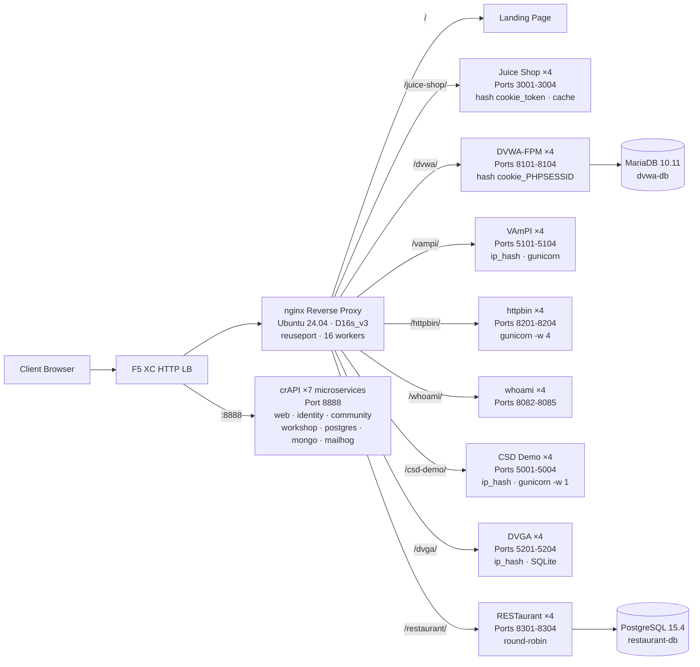

## Scopo

Questo componente fornisce un singolo server di origine che ospita molteplici applicazioni web vulnerabili per demo di test di sicurezza. Rappresenta l'"origin" in una tipica architettura di bilanciamento del carico -- il server di contenuti backend che un HTTP load balancer F5 XC protegge.

Nelle architetture di produzione:

```
End User -> F5 XC HTTP LB (WAF/Bot/API Security) -> Origin Server -> Application
```

Questo componente sostituisce un vero server applicativo di produzione con una VM appositamente costruita che esegue applicazioni vulnerabili ben note che attivano regole WAF, policy di sicurezza API e rilevamento bot.

## Architettura



**41 container** su una VM Standard_D16s_v3 (16 vCPU, 64 GiB RAM, 60 GiB disco).

Il reverse proxy nginx:

- **Ascolta sulla porta 80** con `reuseport` e `backlog=4096` per traffico CDN ad alta concorrenza
- **Instrada per prefisso di percorso** verso pool upstream con bilanciamento del carico (4 istanze per applicazione)
- **Sticky session** per prevenire la perdita di stato: `hash $cookie_token` per Juice Shop, `hash $cookie_PHPSESSID` per DVWA, `ip_hash` per VAmPI e CSD Demo (stato SQLite/in-memory per istanza)
- **Proxy cache** per gli asset statici di Juice Shop (zona da 10 MB, massimo 100 MB, TTL 60 s)
- **Logging degli accessi disabilitato** per prevenire l'esaurimento del disco sotto test di carico CDN (logrotate come difesa in profondità)
- **Inoltro degli header del client** (`X-Real-IP`, `X-Forwarded-For`, `X-Forwarded-Proto`) per la visibilità dell'origine
- **Tuning del kernel** tramite sysctl: `somaxconn=65535`, `tcp_tw_reuse=1`, `ip_local_port_range=1024-65535`

## Mappatura delle Applicazioni

| Percorso | Upstream | Istanze | Porte | Sticky Session | Scopo |
|---|---|---|---|---|---|
| `/` | nginx | -- | -- | -- | Pagina di destinazione con link a tutte le app |
| `/health` | nginx | -- | -- | -- | Endpoint di salute JSON (9 app elencate) |
| `/juice-shop/` | juice_shop | 4 | 3001-3004 | `hash $cookie_token` | Sicurezza applicazioni web moderne (XSS, injection, CSRF) |
| `/dvwa/` | dvwa | 4 + MariaDB | 8101-8104 | `hash $cookie_PHPSESSID` | Test WAF classico con difficoltà regolabile |
| `/vampi/` | vampi | 4 | 5101-5104 | `ip_hash` | Test di sicurezza API REST (OWASP API Top 10) |
| `/httpbin/` | httpbin_up | 4 | 8201-8204 | -- | Servizio di richiesta/risposta HTTP per demo API |
| `/whoami/` | whoami_up | 4 | 8082-8085 | -- | Diagnostica delle richieste -- mostra tutti gli header, IP del client |
| `/csd-demo/` | csd_demo | 4 | 5001-5004 | `ip_hash` | Test Client-Side Defense (attacchi Magecart) |
| `/dvga/` | dvga | 4 | 5201-5204 | `ip_hash` | Test di sicurezza API GraphQL (injection, DoS, bypass autenticazione) |
| `/restaurant/` | restaurant | 4 + PostgreSQL | 8301-8304 | -- | Sicurezza API REST (OWASP API Top 10 2023) |
| `:8888` | crapi | 7 microservizi | 8888 | -- | OWASP crAPI (BOLA, BFLA, mass assignment, SSRF, JWT) |

## Design Modulare dei Componenti

Questo è un elemento di un ambiente lab più ampio. Ogni componente è autonomo e distribuito in modo indipendente:

- **Questo componente** fornisce il server di origine (nginx + container Docker su VM Azure)
- **Simulatore CDN** fornisce il livello edge CDN (caching nginx su VM Azure)
- **Altri componenti** forniscono la configurazione F5 XC, DNS, policy WAF, sicurezza API, ecc.

L'operatore umano aggiunge i componenti uno alla volta. La documentazione di ciascun componente è scritta in modo che un assistente AI possa leggerla e distribuire l'infrastruttura in modo autonomo.

## Perché Queste Applicazioni

| Applicazione | Motivazione della Scelta |
|---|---|
| **Juice Shop** | Progetto di punta OWASP; SPA moderna Node.js con oltre 100 sfide che coprono la OWASP Top 10; mantenuta attivamente; 4 istanze con proxy cache |
| **DVWA** | Standard del settore per test WAF; livelli di sicurezza regolabili (low/medium/high/impossible); build personalizzata php-fpm + nginx per le prestazioni; backend MariaDB 10.11 condiviso |
| **VAmPI** | Costruita appositamente per OWASP API Security Top 10; API REST con vulnerabilità note; gunicorn con 4 worker per istanza; ip_hash sticky per coerenza SQLite |
| **httpbin** | Il servizio canonico di test HTTP di Kenneth Reitz; gunicorn con 4 worker gevent; utile per demo API e ispezione delle richieste |
| **whoami** | Server echo delle richieste di Traefik; mostra tutti i dettagli della richiesta come li vede l'origine -- essenziale per verificare l'iniezione degli header di F5 XC |
| **CSD Demo** | Pagina di checkout personalizzata con 5 attacchi in stile Magecart attivabili (card skimmer, formjacker, keylogger, cryptominer, DOM hijack); endpoint di esfiltrazione + dashboard dell'attaccante; gunicorn single-worker per persistenza dello stato in memoria |
| **DVGA** | Damn Vulnerable GraphQL Application; vulnerabilità specifiche di GraphQL incluse injection, DoS, attacchi di batching e bypass dell'autorizzazione; UI GraphiQL per esplorazione interattiva; ip_hash sticky per SQLite per istanza |
| **RESTaurant** | Damn Vulnerable RESTaurant API Game; costruita appositamente per OWASP API Security Top 10 2023; FastAPI con Swagger UI; backend PostgreSQL 15.4 condiviso; copre BOLA, BFLA, mass assignment, SSRF e injection |
| **crAPI** | OWASP Completely Ridiculous API; architettura a 7 microservizi che copre BOLA, BFLA, mass assignment, SSRF, manipolazione JWT e NoSQL injection; porta dedicata 8888 (SPA con percorsi API hardcoded); MailHog per la cattura delle email |
