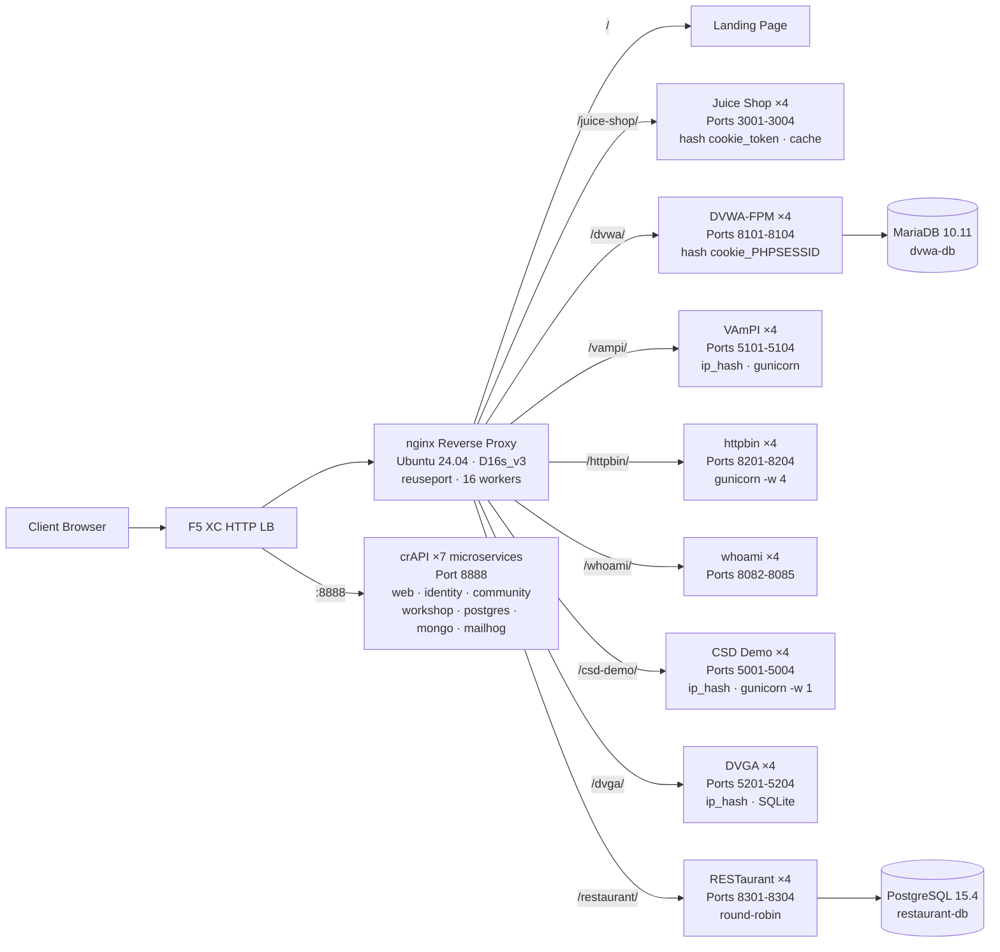

## 目的

このコンポーネントは、セキュリティテストデモ用の複数の脆弱なWebアプリケーションをホストする単一のオリジンサーバーを提供します。これは一般的なロードバランサーアーキテクチャにおける「オリジン」、つまりF5 XC HTTPロードバランサーが保護するバックエンドコンテンツサーバーを表します。

本番環境のアーキテクチャでは：

```
End User -> F5 XC HTTP LB (WAF/Bot/API Security) -> Origin Server -> Application
```

このコンポーネントは、実際の本番アプリケーションサーバーを、WAFルール、APIセキュリティポリシー、およびボット検知をトリガーする著名な脆弱性アプリケーションを実行する専用VMに置き換えます。

## アーキテクチャ



Standard_D16s_v3 VM（16 vCPU、64 GiB RAM、60 GiBディスク）上に**41コンテナ**を配置。

nginxリバースプロキシ：

- **ポート80でリッスン** - `reuseport`および`backlog=4096`による高並行性CDNトラフィック対応
- **パスプレフィックスによるルーティング** - ロードバランスされたアップストリームプール（アプリケーションごとに4インスタンス）へ振り分け
- **スティッキーセッション**によるステート損失の防止：Juice Shopには`hash $cookie_token`、DVWAには`hash $cookie_PHPSESSID`、VAmPIおよびCSD Demoには`ip_hash`（インスタンスごとのSQLite/インメモリステート）
- **プロキシキャッシュ** - Juice Shop静的アセット用（10 MBゾーン、最大100 MB、60秒TTL）
- **アクセスログ無効化** - CDN負荷テスト時のディスク枯渇防止（多層防御としてlogrotateを設定）
- **クライアントヘッダーの転送**（`X-Real-IP`、`X-Forwarded-For`、`X-Forwarded-Proto`）- オリジンでの可視性確保
- **カーネルチューニング**（sysctl経由）：`somaxconn=65535`、`tcp_tw_reuse=1`、`ip_local_port_range=1024-65535`

## アプリケーションマッピング

| パス | アップストリーム | インスタンス数 | ポート | スティッキーセッション | 目的 |
|---|---|---|---|---|---|
| `/` | nginx | -- | -- | -- | 全アプリへのリンクを含むランディングページ |
| `/health` | nginx | -- | -- | -- | JSONヘルスエンドポイント（9アプリ表示） |
| `/juice-shop/` | juice_shop | 4 | 3001-3004 | `hash $cookie_token` | モダンWebアプリセキュリティ（XSS、インジェクション、CSRF） |
| `/dvwa/` | dvwa | 4 + MariaDB | 8101-8104 | `hash $cookie_PHPSESSID` | 難易度調整可能な古典的WAFテスト |
| `/vampi/` | vampi | 4 | 5101-5104 | `ip_hash` | REST APIセキュリティテスト（OWASP API Top 10） |
| `/httpbin/` | httpbin_up | 4 | 8201-8204 | -- | APIデモ用HTTPリクエスト/レスポンスサービス |
| `/whoami/` | whoami_up | 4 | 8082-8085 | -- | リクエスト診断 -- 全ヘッダーとクライアントIPを表示 |
| `/csd-demo/` | csd_demo | 4 | 5001-5004 | `ip_hash` | クライアントサイドディフェンステスト（Magecart攻撃） |
| `/dvga/` | dvga | 4 | 5201-5204 | `ip_hash` | GraphQL APIセキュリティテスト（インジェクション、DoS、認証バイパス） |
| `/restaurant/` | restaurant | 4 + PostgreSQL | 8301-8304 | -- | REST APIセキュリティ（OWASP API Top 10 2023） |
| `:8888` | crapi | 7マイクロサービス | 8888 | -- | OWASP crAPI（BOLA、BFLA、マスアサインメント、SSRF、JWT） |

## モジュラーコンポーネント設計

これは、より大規模なラボ環境の一部です。各コンポーネントは自己完結型で、独立してデプロイされます：

- **このコンポーネント**はオリジンサーバーを提供（Azure VM上のnginx + Dockerコンテナ）
- **CDNシミュレーター**はCDNエッジレイヤーを提供（Azure VM上のnginxキャッシュ）
- **その他のコンポーネント**はF5 XC設定、DNS、WAFポリシー、APIセキュリティなどを提供

人間のオペレーターがコンポーネントを1つずつ追加します。各コンポーネントのドキュメントは、AIアシスタントが読み取ってインフラストラクチャを自律的にデプロイできるように記述されています。

## これらのアプリケーションを選定した理由

| アプリケーション | 選定理由 |
|---|---|
| **Juice Shop** | OWASPフラッグシッププロジェクト。OWASP Top 10をカバーする100以上のチャレンジを持つモダンなNode.js SPA。活発にメンテナンスされており、プロキシキャッシュ付き4インスタンス構成 |
| **DVWA** | WAFテストの業界標準。調整可能なセキュリティレベル（low/medium/high/impossible）。パフォーマンスのためのカスタムphp-fpm + nginxビルド。共有MariaDB 10.11バックエンド |
| **VAmPI** | OWASP APIセキュリティTop 10向けに専用設計。既知の脆弱性を持つREST API。インスタンスごとにgunicorn 4ワーカー。SQLite整合性のためのip_hashスティッキー |
| **httpbin** | Kenneth Reitzの標準的なHTTPテストサービス。gunicorn 4 geventワーカー。APIデモやリクエスト検査に有用 |
| **whoami** | Traefikのリクエストエコーサーバー。オリジンが受け取った完全なリクエスト詳細を表示 -- F5 XCヘッダーインジェクションの検証に不可欠 |
| **CSD Demo** | 5つのトグル可能なMagecartスタイル攻撃（カードスキマー、フォームジャッカー、キーロガー、クリプトマイナー、DOMハイジャック）を持つカスタムチェックアウトページ。エクスフィルエンドポイント + 攻撃者ダッシュボード。インメモリステート永続化のためgunicornシングルワーカー |
| **DVGA** | Damn Vulnerable GraphQL Application。インジェクション、DoS、バッチ攻撃、認証バイパスなどGraphQL固有の脆弱性。対話的な探索のためのGraphiQL UI。インスタンスごとのSQLiteのためip_hashスティッキー |
| **RESTaurant** | Damn Vulnerable RESTaurant API Game。OWASP APIセキュリティTop 10 2023向けに専用設計。Swagger UI付きFastAPI。共有PostgreSQL 15.4バックエンド。BOLA、BFLA、マスアサインメント、SSRF、インジェクションをカバー |
| **crAPI** | OWASP Completely Ridiculous API。BOLA、BFLA、マスアサインメント、SSRF、JWT操作、NoSQLインジェクションをカバーする7マイクロサービスアーキテクチャ。専用ポート8888（ハードコードされたAPIパスを持つSPA）。メールキャプチャ用MailHog |
