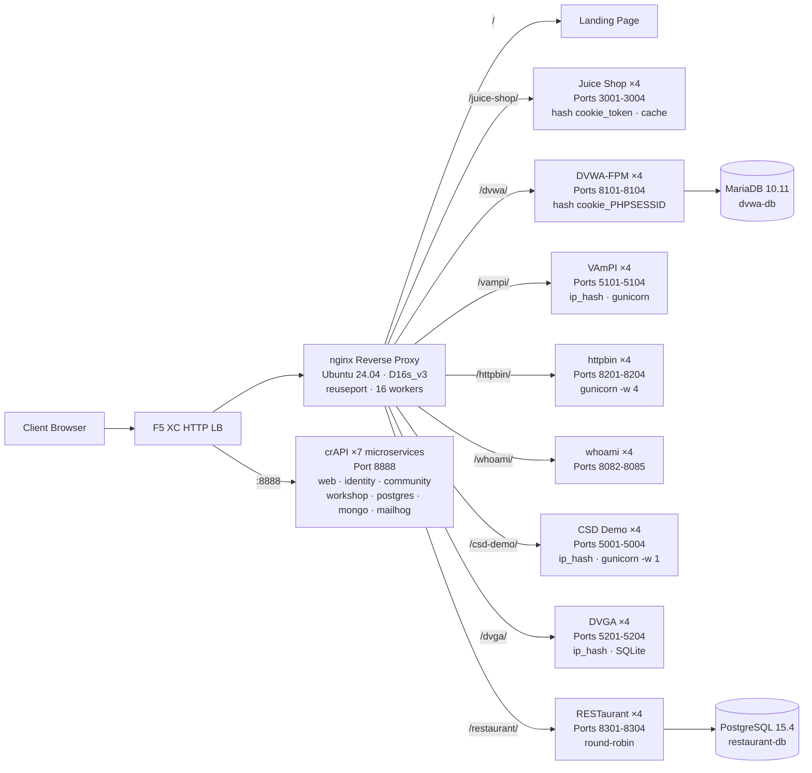

## 目的

このコンポーネントは、セキュリティテストデモ用に複数の脆弱な Web アプリケーションをホストする単一のオリジンサーバーを提供します。典型的なロードバランサーアーキテクチャにおける「オリジン」、すなわち F5 XC HTTP ロードバランサーが保護するバックエンドコンテンツサーバーを表します。

本番アーキテクチャでは:

```
エンドユーザー -> F5 XC HTTP LB (WAF/Bot/API セキュリティ) -> オリジンサーバー -> アプリケーション
```

このコンポーネントは、実際の本番アプリケーションサーバーの代わりに、WAF ルール、API セキュリティポリシー、Bot 検知をトリガーする著名な脆弱アプリケーションを実行する専用 VM を使用します。

## アーキテクチャ



**41 コンテナ**が Standard_D16s_v3 VM（16 vCPU、64 GiB RAM、60 GiB ディスク）上で動作します。

nginx リバースプロキシの特徴:

- **ポート 80 でリッスン**（`reuseport` および `backlog=4096` を使用し、高並列 CDN トラフィックに対応）
- **パスプレフィックスによるルーティング**（アプリケーションごとに 4 インスタンスのロードバランシングアップストリームプールへ振り分け）
- **スティッキーセッション**によるステート損失の防止：Juice Shop には `hash $cookie_token`、DVWA には `hash $cookie_PHPSESSID`、VAmPI および CSD Demo（インスタンスごとの SQLite/インメモリステート）には `ip_hash` を使用
- **プロキシキャッシュ**（Juice Shop の静的アセット向け：10 MB ゾーン、最大 100 MB、TTL 60 秒）
- **アクセスログ無効化**による CDN 負荷テスト時のディスク枯渇防止（logrotate を多層防御として使用）
- クライアントヘッダー（`X-Real-IP`、`X-Forwarded-For`、`X-Forwarded-Proto`）を**転送**してオリジン可視性を確保
- sysctl による**カーネルチューニング**：`somaxconn=65535`、`tcp_tw_reuse=1`、`ip_local_port_range=1024-65535`

## アプリケーションマッピング

| パス | アップストリーム | インスタンス数 | ポート | スティッキーセッション | 目的 |
|---|---|---|---|---|---|
| `/` | nginx | -- | -- | -- | 全アプリへのリンクを含むランディングページ |
| `/health` | nginx | -- | -- | -- | JSON ヘルスエンドポイント（9 アプリ一覧） |
| `/juice-shop/` | juice_shop | 4 | 3001-3004 | `hash $cookie_token` | モダン Web アプリセキュリティ（XSS、インジェクション、CSRF） |
| `/dvwa/` | dvwa | 4 + MariaDB | 8101-8104 | `hash $cookie_PHPSESSID` | 難易度調整可能なクラシック WAF テスト |
| `/vampi/` | vampi | 4 | 5101-5104 | `ip_hash` | REST API セキュリティテスト（OWASP API Top 10） |
| `/httpbin/` | httpbin_up | 4 | 8201-8204 | -- | API デモ向け HTTP リクエスト/レスポンスサービス |
| `/whoami/` | whoami_up | 4 | 8082-8085 | -- | リクエスト診断 -- 全ヘッダーとクライアント IP を表示 |
| `/csd-demo/` | csd_demo | 4 | 5001-5004 | `ip_hash` | クライアントサイド防御テスト（Magecart 攻撃） |
| `/dvga/` | dvga | 4 | 5201-5204 | `ip_hash` | GraphQL API セキュリティテスト（インジェクション、DoS、認証バイパス） |
| `/restaurant/` | restaurant | 4 + PostgreSQL | 8301-8304 | -- | REST API セキュリティ（OWASP API Top 10 2023） |
| `:8888` | crapi | 7 マイクロサービス | 8888 | -- | OWASP crAPI（BOLA、BFLA、マスアサインメント、SSRF、JWT） |

## モジュール型コンポーネント設計

これはより大規模なラボ環境の一部です。各コンポーネントは自己完結型であり、独立してデプロイされます:

- **このコンポーネント**はオリジンサーバーを提供します（Azure VM 上の nginx + Docker コンテナ）
- **CDN シミュレーター**は CDN エッジレイヤーを提供します（Azure VM 上の nginx キャッシュ）
- **その他のコンポーネント**は F5 XC 設定、DNS、WAF ポリシー、API セキュリティなどを提供します

人間のオペレーターはコンポーネントを一つずつ追加します。各コンポーネントのドキュメントは、AI アシスタントが読み取ってインフラを自律的にデプロイできるように記述されています。

## これらのアプリケーションを選択した理由

| アプリケーション | 選択理由 |
|---|---|
| **Juice Shop** | OWASP フラッグシッププロジェクト；OWASP Top 10 を網羅する 100 以上のチャレンジを持つモダンな Node.js SPA；活発にメンテナンス；プロキシキャッシュ付き 4 インスタンス |
| **DVWA** | WAF テストの業界標準；セキュリティレベル調整可能（low/medium/high/impossible）；パフォーマンス向けカスタム php-fpm + nginx ビルド；共有 MariaDB 10.11 バックエンド |
| **VAmPI** | OWASP API セキュリティ Top 10 専用設計；既知の脆弱性を持つ REST API；インスタンスごとに 4 ワーカーの gunicorn；SQLite 一貫性のための ip_hash スティッキー |
| **httpbin** | Kenneth Reitz による標準的な HTTP テストサービス；4 つの gevent ワーカーを持つ gunicorn；API デモおよびリクエスト検査に有用 |
| **whoami** | Traefik のリクエストエコーサーバー；オリジンが受け取るリクエストの詳細を完全表示 -- F5 XC ヘッダーインジェクションの検証に必須 |
| **CSD Demo** | 5 つの切り替え可能な Magecart スタイル攻撃（カードスキマー、フォームジャッカー、キーロガー、クリプトマイナー、DOM ハイジャック）を持つカスタムチェックアウトページ；流出エンドポイント + 攻撃者ダッシュボード；インメモリステート保持のための gunicorn シングルワーカー |
| **DVGA** | Damn Vulnerable GraphQL Application；インジェクション、DoS、バッチング攻撃、認可バイパスを含む GraphQL 固有の脆弱性；インタラクティブ探索のための GraphiQL UI；インスタンスごとの SQLite のための ip_hash スティッキー |
| **RESTaurant** | Damn Vulnerable RESTaurant API Game；OWASP API セキュリティ Top 10 2023 専用設計；Swagger UI 付き FastAPI；共有 PostgreSQL 15.4 バックエンド；BOLA、BFLA、マスアサインメント、SSRF、インジェクションをカバー |
| **crAPI** | OWASP Completely Ridiculous API；BOLA、BFLA、マスアサインメント、SSRF、JWT 操作、NoSQL インジェクションをカバーする 7 マイクロサービスアーキテクチャ；専用ポート 8888（ハードコードされた API パスを持つ SPA）；メールキャプチャのための MailHog |
