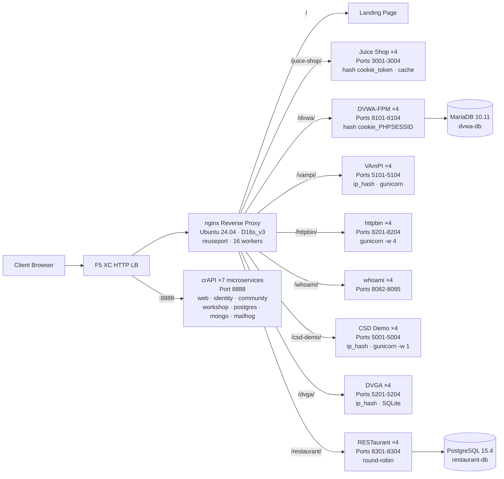

## 목적

이 컴포넌트는 보안 테스트 데모를 위해 여러 취약한 웹 애플리케이션을 호스팅하는 단일 오리진 서버를 제공합니다. 일반적인 로드 밸런서 아키텍처에서 "오리진" 역할을 합니다 -- F5 XC HTTP 로드 밸런서가 보호하는 백엔드 콘텐츠 서버입니다.

프로덕션 아키텍처에서:

```
최종 사용자 -> F5 XC HTTP LB (WAF/봇/API 보안) -> 오리진 서버 -> 애플리케이션
```

이 컴포넌트는 실제 프로덕션 애플리케이션 서버를 대체하며, WAF 규칙, API 보안 정책, 봇 탐지를 트리거하는 잘 알려진 취약한 애플리케이션을 실행하는 전용 VM으로 구성됩니다.

## 아키텍처



Standard_D16s_v3 VM(16 vCPU, 64 GiB RAM, 60 GiB 디스크)에 **41개의 컨테이너**가 배포됩니다.

nginx 리버스 프록시:

- **포트 80에서 수신 대기**하며 `reuseport`와 `backlog=4096`으로 높은 동시성의 CDN 트래픽을 처리합니다
- **경로 접두사 기반 라우팅**으로 로드 밸런싱된 업스트림 풀(애플리케이션당 4개 인스턴스)로 트래픽을 분배합니다
- **스티키 세션**으로 상태 손실을 방지합니다: Juice Shop의 경우 `hash $cookie_token`, DVWA의 경우 `hash $cookie_PHPSESSID`, VAmPI와 CSD Demo의 경우 `ip_hash`(인스턴스별 SQLite/인메모리 상태)
- **프록시 캐시**로 Juice Shop 정적 자산을 캐싱합니다(10 MB 존, 100 MB 최대, 60초 TTL)
- **액세스 로깅 비활성화**로 CDN 부하 테스트 시 디스크 소진을 방지합니다(심층 방어로 logrotate 적용)
- **클라이언트 헤더 전달**(`X-Real-IP`, `X-Forwarded-For`, `X-Forwarded-Proto`)로 오리진 가시성을 확보합니다
- **커널 튜닝**을 sysctl로 적용합니다: `somaxconn=65535`, `tcp_tw_reuse=1`, `ip_local_port_range=1024-65535`

## 애플리케이션 매핑

| 경로 | 업스트림 | 인스턴스 | 포트 | 스티키 세션 | 용도 |
|---|---|---|---|---|---|
| `/` | nginx | -- | -- | -- | 모든 앱으로의 링크가 있는 랜딩 페이지 |
| `/health` | nginx | -- | -- | -- | JSON 헬스 엔드포인트(9개 앱 목록) |
| `/juice-shop/` | juice_shop | 4 | 3001-3004 | `hash $cookie_token` | 최신 웹 앱 보안(XSS, 인젝션, CSRF) |
| `/dvwa/` | dvwa | 4 + MariaDB | 8101-8104 | `hash $cookie_PHPSESSID` | 난이도 조절 가능한 클래식 WAF 테스트 |
| `/vampi/` | vampi | 4 | 5101-5104 | `ip_hash` | REST API 보안 테스트(OWASP API Top 10) |
| `/httpbin/` | httpbin_up | 4 | 8201-8204 | -- | API 데모용 HTTP 요청/응답 서비스 |
| `/whoami/` | whoami_up | 4 | 8082-8085 | -- | 요청 진단 -- 모든 헤더, 클라이언트 IP 표시 |
| `/csd-demo/` | csd_demo | 4 | 5001-5004 | `ip_hash` | 클라이언트 측 방어 테스트(Magecart 공격) |
| `/dvga/` | dvga | 4 | 5201-5204 | `ip_hash` | GraphQL API 보안 테스트(인젝션, DoS, 인증 우회) |
| `/restaurant/` | restaurant | 4 + PostgreSQL | 8301-8304 | -- | REST API 보안(OWASP API Top 10 2023) |
| `:8888` | crapi | 7개 마이크로서비스 | 8888 | -- | OWASP crAPI(BOLA, BFLA, 대량 할당, SSRF, JWT) |

## 모듈형 컴포넌트 설계

이것은 더 큰 랩 환경의 한 구성 요소입니다. 각 컴포넌트는 자체 완결적이며 독립적으로 배포됩니다:

- **이 컴포넌트**는 오리진 서버를 제공합니다(Azure VM의 nginx + Docker 컨테이너)
- **CDN 시뮬레이터**는 CDN 엣지 레이어를 제공합니다(Azure VM의 nginx 캐싱)
- **기타 컴포넌트**는 F5 XC 구성, DNS, WAF 정책, API 보안 등을 제공합니다

운영자가 컴포넌트를 하나씩 추가합니다. 각 컴포넌트의 문서는 AI 어시스턴트가 읽고 인프라를 자율적으로 배포할 수 있도록 작성되어 있습니다.

## 애플리케이션 선정 이유

| 애플리케이션 | 선정 이유 |
|---|---|
| **Juice Shop** | OWASP 대표 프로젝트; OWASP Top 10을 다루는 100개 이상의 챌린지가 포함된 최신 Node.js SPA; 활발히 유지보수됨; 프록시 캐시가 적용된 4개 인스턴스 |
| **DVWA** | WAF 테스트의 업계 표준; 조절 가능한 보안 수준(low/medium/high/impossible); 성능을 위한 커스텀 php-fpm + nginx 빌드; 공유 MariaDB 10.11 백엔드 |
| **VAmPI** | OWASP API Security Top 10 전용으로 제작; 알려진 취약점이 있는 REST API; 인스턴스당 4개 워커의 gunicorn; SQLite 일관성을 위한 ip_hash 스티키 |
| **httpbin** | Kenneth Reitz의 표준 HTTP 테스트 서비스; 4개 gevent 워커의 gunicorn; API 데모 및 요청 검사에 유용 |
| **whoami** | Traefik의 요청 에코 서버; 오리진에서 보는 전체 요청 세부 정보를 표시 -- F5 XC 헤더 주입 검증에 필수적 |
| **CSD Demo** | 5가지 전환 가능한 Magecart 스타일 공격(카드 스키머, 폼재커, 키로거, 크립토마이너, DOM 하이재킹)이 포함된 커스텀 결제 페이지; 유출 엔드포인트 + 공격자 대시보드; 인메모리 상태 유지를 위한 gunicorn 단일 워커 |
| **DVGA** | Damn Vulnerable GraphQL Application; 인젝션, DoS, 배칭 공격, 인가 우회를 포함한 GraphQL 특화 취약점; 대화형 탐색을 위한 GraphiQL UI; 인스턴스별 SQLite를 위한 ip_hash 스티키 |
| **RESTaurant** | Damn Vulnerable RESTaurant API Game; OWASP API Security Top 10 2023 전용으로 제작; Swagger UI가 포함된 FastAPI; 공유 PostgreSQL 15.4 백엔드; BOLA, BFLA, 대량 할당, SSRF, 인젝션을 다룸 |
| **crAPI** | OWASP Completely Ridiculous API; BOLA, BFLA, 대량 할당, SSRF, JWT 조작, NoSQL 인젝션을 다루는 7개 마이크로서비스 아키텍처; 전용 포트 8888(하드코딩된 API 경로의 SPA); 이메일 캡처를 위한 MailHog |
