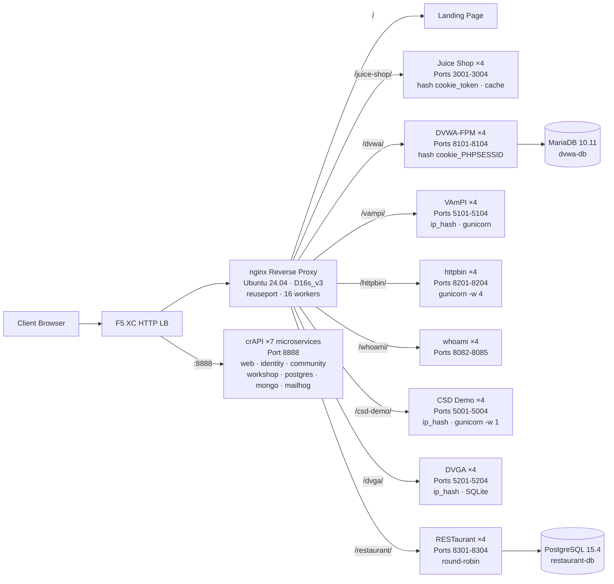

## 목적

이 구성 요소는 보안 테스트 데모를 위한 다수의 취약한 웹 애플리케이션을 호스팅하는 단일 오리진 서버를 제공합니다. 이는 일반적인 로드 밸런서 아키텍처에서 "오리진", 즉 F5 XC HTTP 로드 밸런서가 보호하는 백엔드 콘텐츠 서버를 나타냅니다.

프로덕션 아키텍처:

```
End User -> F5 XC HTTP LB (WAF/Bot/API Security) -> Origin Server -> Application
```

이 구성 요소는 실제 프로덕션 애플리케이션 서버를 WAF 규칙, API 보안 정책, 봇 탐지를 트리거하는 잘 알려진 취약 애플리케이션을 실행하는 전용 VM으로 대체합니다.

## 아키텍처



Standard_D16s_v3 VM (16 vCPU, 64 GiB RAM, 60 GiB 디스크)에 **41개 컨테이너**가 배포됩니다.

nginx 리버스 프록시:

- 고동시성 CDN 트래픽을 위해 `reuseport` 및 `backlog=4096`을 사용하여 **포트 80에서 수신 대기**
- 애플리케이션당 4개 인스턴스로 구성된 부하 분산 업스트림 풀로 **경로 접두사 기반 라우팅**
- **고정 세션**으로 상태 손실 방지: Juice Shop에는 `hash $cookie_token`, DVWA에는 `hash $cookie_PHPSESSID`, VAmPI 및 CSD Demo에는 `ip_hash` 사용 (인스턴스별 SQLite/인메모리 상태)
- Juice Shop 정적 자산에 대한 **프록시 캐시** (10 MB 영역, 최대 100 MB, TTL 60초)
- CDN 부하 테스트 중 디스크 소진 방지를 위해 **접근 로깅 비활성화** (심층 방어로 logrotate 사용)
- 오리진 가시성을 위한 **클라이언트 헤더 전달** (`X-Real-IP`, `X-Forwarded-For`, `X-Forwarded-Proto`)
- sysctl을 통한 **커널 튜닝**: `somaxconn=65535`, `tcp_tw_reuse=1`, `ip_local_port_range=1024-65535`

## 애플리케이션 매핑

| 경로 | 업스트림 | 인스턴스 | 포트 | 고정 세션 | 목적 |
|---|---|---|---|---|---|
| `/` | nginx | -- | -- | -- | 모든 앱 링크가 포함된 랜딩 페이지 |
| `/health` | nginx | -- | -- | -- | JSON 상태 확인 엔드포인트 (9개 앱 나열) |
| `/juice-shop/` | juice_shop | 4 | 3001-3004 | `hash $cookie_token` | 모던 웹 앱 보안 (XSS, 인젝션, CSRF) |
| `/dvwa/` | dvwa | 4 + MariaDB | 8101-8104 | `hash $cookie_PHPSESSID` | 난이도 조절 가능한 클래식 WAF 테스트 |
| `/vampi/` | vampi | 4 | 5101-5104 | `ip_hash` | REST API 보안 테스트 (OWASP API Top 10) |
| `/httpbin/` | httpbin_up | 4 | 8201-8204 | -- | API 데모 및 HTTP 요청/응답 서비스 |
| `/whoami/` | whoami_up | 4 | 8082-8085 | -- | 요청 진단 -- 모든 헤더 및 클라이언트 IP 표시 |
| `/csd-demo/` | csd_demo | 4 | 5001-5004 | `ip_hash` | 클라이언트 측 방어 테스트 (Magecart 공격) |
| `/dvga/` | dvga | 4 | 5201-5204 | `ip_hash` | GraphQL API 보안 테스트 (인젝션, DoS, 인증 우회) |
| `/restaurant/` | restaurant | 4 + PostgreSQL | 8301-8304 | -- | REST API 보안 (OWASP API Top 10 2023) |
| `:8888` | crapi | 7 마이크로서비스 | 8888 | -- | OWASP crAPI (BOLA, BFLA, 대량 할당, SSRF, JWT) |

## 모듈식 구성 요소 설계

이것은 더 큰 랩 환경의 일부입니다. 각 구성 요소는 독립적으로 구성되어 배포됩니다:

- **이 구성 요소**는 오리진 서버를 제공합니다 (Azure VM의 nginx + Docker 컨테이너)
- **CDN 시뮬레이터**는 CDN 에지 레이어를 제공합니다 (Azure VM의 nginx 캐싱)
- **기타 구성 요소**는 F5 XC 구성, DNS, WAF 정책, API 보안 등을 제공합니다

운영자는 구성 요소를 하나씩 추가합니다. 각 구성 요소의 문서는 AI 어시스턴트가 읽고 인프라를 자율적으로 배포할 수 있도록 작성되었습니다.

## 이 애플리케이션을 선택한 이유

| 애플리케이션 | 선택 이유 |
|---|---|
| **Juice Shop** | OWASP 주력 프로젝트; OWASP Top 10을 다루는 100개 이상의 챌린지가 포함된 모던 Node.js SPA; 활발히 유지 관리됨; 프록시 캐시를 갖춘 4개 인스턴스 |
| **DVWA** | WAF 테스트의 업계 표준; 조절 가능한 보안 수준 (낮음/중간/높음/불가능); 성능을 위한 맞춤형 php-fpm + nginx 빌드; 공유 MariaDB 10.11 백엔드 |
| **VAmPI** | OWASP API 보안 Top 10을 위해 특별 제작; 알려진 취약점이 있는 REST API; 인스턴스당 4개 워커의 gunicorn; SQLite 일관성을 위한 ip_hash 고정 세션 |
| **httpbin** | Kenneth Reitz의 표준 HTTP 테스트 서비스; 4개 gevent 워커의 gunicorn; API 데모 및 요청 검사에 유용 |
| **whoami** | Traefik의 요청 에코 서버; 오리진이 보는 전체 요청 세부 정보 표시 -- F5 XC 헤더 인젝션 검증에 필수 |
| **CSD Demo** | 5가지 토글 가능한 Magecart 방식 공격(카드 스키머, 폼재킹, 키로거, 크립토마이너, DOM 하이재킹)이 포함된 맞춤형 결제 페이지; 유출 엔드포인트 및 공격자 대시보드; 인메모리 상태 유지를 위한 gunicorn 단일 워커 |
| **DVGA** | Damn Vulnerable GraphQL Application; 인젝션, DoS, 배치 공격, 인증 우회를 포함한 GraphQL 특화 취약점; 인터랙티브 탐색을 위한 GraphiQL UI; 인스턴스별 SQLite를 위한 ip_hash 고정 세션 |
| **RESTaurant** | Damn Vulnerable RESTaurant API Game; OWASP API 보안 Top 10 2023을 위해 특별 제작; Swagger UI가 포함된 FastAPI; 공유 PostgreSQL 15.4 백엔드; BOLA, BFLA, 대량 할당, SSRF, 인젝션 포함 |
| **crAPI** | OWASP Completely Ridiculous API; BOLA, BFLA, 대량 할당, SSRF, JWT 조작, NoSQL 인젝션을 다루는 7개 마이크로서비스 아키텍처; 전용 포트 8888 (하드코딩된 API 경로가 있는 SPA); 이메일 캡처를 위한 MailHog |
