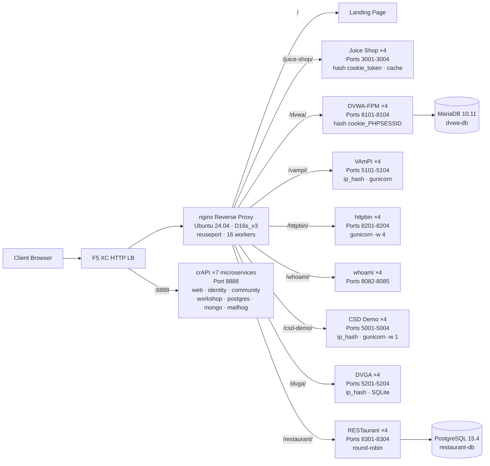

## Propósito

Este componente fornece um servidor de origem único hospedando múltiplas aplicações web vulneráveis para demonstrações de testes de segurança. Ele representa a "origem" em uma arquitetura típica de balanceador de carga — o servidor de conteúdo backend que um HTTP load balancer F5 XC protege.

Em arquiteturas de produção:

```
End User -> F5 XC HTTP LB (WAF/Bot/API Security) -> Origin Server -> Application
```

Este componente substitui um servidor de aplicação de produção real por uma VM construída especificamente para executar aplicações vulneráveis conhecidas que acionam regras de WAF, políticas de segurança de API e detecção de bots.

## Arquitetura



**41 contêineres** em uma VM Standard_D16s_v3 (16 vCPU, 64 GiB RAM, 60 GiB de disco).

O proxy reverso nginx:

- **Escuta na porta 80** com `reuseport` e `backlog=4096` para tráfego CDN de alta concorrência
- **Roteia por prefixo de caminho** para pools de upstream balanceados (4 instâncias por aplicação)
- **Sessões fixas** evitam perda de estado: `hash $cookie_token` para Juice Shop, `hash $cookie_PHPSESSID` para DVWA, `ip_hash` para VAmPI e CSD Demo (estado SQLite/em memória por instância)
- **Cache de proxy** para assets estáticos do Juice Shop (zona de 10 MB, máximo de 100 MB, TTL de 60 s)
- **Log de acesso desabilitado** para evitar esgotamento de disco sob teste de carga CDN (logrotate como defesa em profundidade)
- **Repassa cabeçalhos do cliente** (`X-Real-IP`, `X-Forwarded-For`, `X-Forwarded-Proto`) para visibilidade na origem
- **Ajuste de kernel** via sysctl: `somaxconn=65535`, `tcp_tw_reuse=1`, `ip_local_port_range=1024-65535`

## Mapeamento de Aplicações

| Caminho | Upstream | Instâncias | Portas | Sessão Fixa | Propósito |
|---|---|---|---|---|---|
| `/` | nginx | -- | -- | -- | Página de entrada com links para todas as aplicações |
| `/health` | nginx | -- | -- | -- | Endpoint de saúde JSON (9 aplicações listadas) |
| `/juice-shop/` | juice_shop | 4 | 3001-3004 | `hash $cookie_token` | Segurança de aplicação web moderna (XSS, injeção, CSRF) |
| `/dvwa/` | dvwa | 4 + MariaDB | 8101-8104 | `hash $cookie_PHPSESSID` | Testes clássicos de WAF com dificuldade ajustável |
| `/vampi/` | vampi | 4 | 5101-5104 | `ip_hash` | Testes de segurança de API REST (OWASP API Top 10) |
| `/httpbin/` | httpbin_up | 4 | 8201-8204 | -- | Serviço de requisição/resposta HTTP para demos de API |
| `/whoami/` | whoami_up | 4 | 8082-8085 | -- | Diagnóstico de requisições — exibe todos os cabeçalhos e IP do cliente |
| `/csd-demo/` | csd_demo | 4 | 5001-5004 | `ip_hash` | Testes de Client-Side Defense (ataques Magecart) |
| `/dvga/` | dvga | 4 | 5201-5204 | `ip_hash` | Testes de segurança de API GraphQL (injeção, DoS, bypass de autenticação) |
| `/restaurant/` | restaurant | 4 + PostgreSQL | 8301-8304 | -- | Segurança de API REST (OWASP API Top 10 2023) |
| `:8888` | crapi | 7 microsserviços | 8888 | -- | OWASP crAPI (BOLA, BFLA, atribuição em massa, SSRF, JWT) |

## Design de Componentes Modulares

Este é um componente de um ambiente de laboratório maior. Cada componente é independente e implantado separadamente:

- **Este componente** fornece o servidor de origem (nginx + contêineres Docker em VM Azure)
- **CDN Simulator** fornece a camada de borda CDN (cache nginx em VM Azure)
- **Outros componentes** fornecem a configuração do F5 XC, DNS, políticas de WAF, segurança de API, etc.

O operador humano adiciona componentes um de cada vez. A documentação de cada componente é escrita para que um assistente de IA possa lê-la e implantar a infraestrutura de forma autônoma.

## Por que Essas Aplicações

| Aplicação | Motivo da Seleção |
|---|---|
| **Juice Shop** | Projeto principal da OWASP; SPA Node.js moderno com mais de 100 desafios cobrindo o OWASP Top 10; mantido ativamente; 4 instâncias com cache de proxy |
| **DVWA** | Padrão da indústria para testes de WAF; níveis de segurança ajustáveis (low/medium/high/impossible); build personalizado de php-fpm + nginx para desempenho; backend MariaDB 10.11 compartilhado |
| **VAmPI** | Construído especificamente para o OWASP API Security Top 10; API REST com vulnerabilidades conhecidas; gunicorn com 4 workers por instância; sticky ip_hash para consistência do SQLite |
| **httpbin** | Serviço canônico de testes HTTP de Kenneth Reitz; gunicorn com 4 workers gevent; útil para demos de API e inspeção de requisições |
| **whoami** | Servidor de eco de requisições do Traefik; exibe detalhes completos da requisição como a origem os vê — essencial para verificar a injeção de cabeçalhos do F5 XC |
| **CSD Demo** | Página de checkout personalizada com 5 ataques estilo Magecart alternáveis (skimmer de cartão, formjacker, keylogger, cryptominer, DOM hijack); endpoint de exfiltração + painel do atacante; gunicorn single-worker para persistência de estado em memória |
| **DVGA** | Damn Vulnerable GraphQL Application; vulnerabilidades específicas de GraphQL incluindo injeção, DoS, ataques de batching e bypass de autorização; UI GraphiQL para exploração interativa; sticky ip_hash para SQLite por instância |
| **RESTaurant** | Damn Vulnerable RESTaurant API Game; construído especificamente para o OWASP API Security Top 10 2023; FastAPI com Swagger UI; backend PostgreSQL 15.4 compartilhado; cobre BOLA, BFLA, atribuição em massa, SSRF e injeção |
| **crAPI** | OWASP Completely Ridiculous API; arquitetura de 7 microsserviços cobrindo BOLA, BFLA, atribuição em massa, SSRF, manipulação de JWT e injeção NoSQL; porta dedicada 8888 (SPA com caminhos de API fixos no código); MailHog para captura de e-mail |
