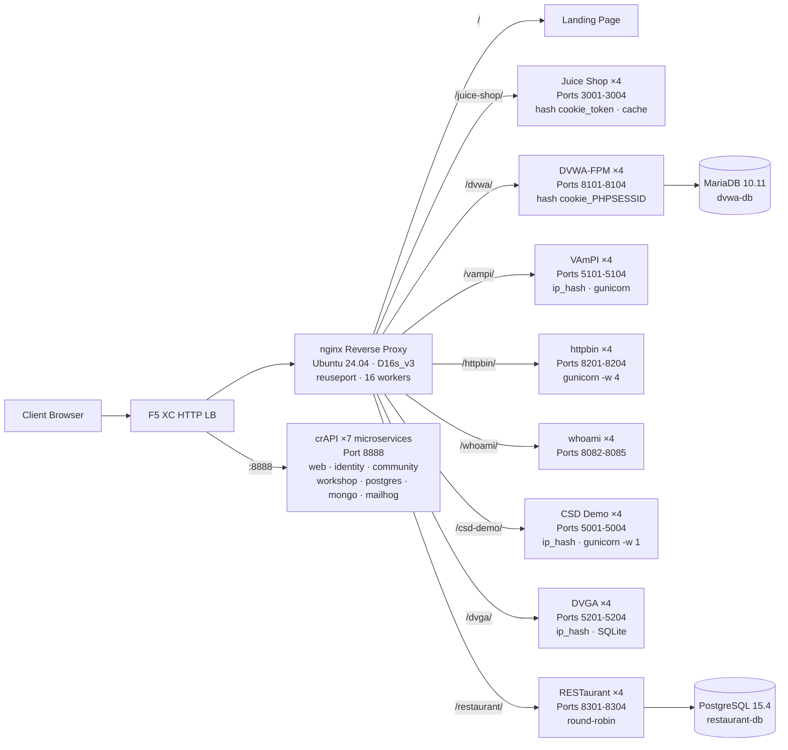

## วัตถุประสงค์

คอมโพเนนต์นี้ให้บริการ origin server ตัวเดียวที่โฮสต์เว็บแอปพลิเคชันที่มีช่องโหว่หลายตัวสำหรับการสาธิตการทดสอบความปลอดภัย ซึ่งเป็นตัวแทนของ "origin" ในสถาปัตยกรรม load balancer ทั่วไป -- เซิร์ฟเวอร์เนื้อหาแบ็กเอนด์ที่ F5 XC HTTP load balancer ปกป้อง

ในสถาปัตยกรรมสำหรับ production:

```
End User -> F5 XC HTTP LB (WAF/Bot/API Security) -> Origin Server -> Application
```

คอมโพเนนต์นี้แทนที่เซิร์ฟเวอร์แอปพลิเคชัน production จริงด้วย VM ที่สร้างขึ้นเพื่อจุดประสงค์เฉพาะ ซึ่งรันแอปพลิเคชันที่มีช่องโหว่ที่เป็นที่รู้จัก เพื่อทริกเกอร์กฎ WAF นโยบายความปลอดภัย API และการตรวจจับบอท

## สถาปัตยกรรม



**คอนเทนเนอร์ 41 ตัว** บน VM Standard_D16s_v3 (16 vCPU, 64 GiB RAM, 60 GiB disk)

nginx reverse proxy:

- **รับฟังที่พอร์ต 80** ด้วย `reuseport` และ `backlog=4096` สำหรับทราฟฟิก CDN ที่มี concurrency สูง
- **กำหนดเส้นทางตาม path prefix** ไปยัง upstream pool ที่ load balance แล้ว (4 อินสแตนซ์ต่อแอปพลิเคชัน)
- **Sticky sessions** ป้องกันการสูญเสียสถานะ: `hash $cookie_token` สำหรับ Juice Shop, `hash $cookie_PHPSESSID` สำหรับ DVWA, `ip_hash` สำหรับ VAmPI และ CSD Demo (สถานะ SQLite/in-memory ต่ออินสแตนซ์)
- **Proxy cache** สำหรับ static assets ของ Juice Shop (โซน 10 MB, สูงสุด 100 MB, TTL 60 วินาที)
- **ปิดการใช้งาน access logging** เพื่อป้องกันดิสก์เต็มภายใต้การทดสอบโหลด CDN (logrotate เป็นมาตรการป้องกันเชิงลึก)
- **ส่งต่อ client headers** (`X-Real-IP`, `X-Forwarded-For`, `X-Forwarded-Proto`) เพื่อให้มองเห็นได้จากฝั่ง origin
- **ปรับแต่ง Kernel** ผ่าน sysctl: `somaxconn=65535`, `tcp_tw_reuse=1`, `ip_local_port_range=1024-65535`

## การแมปแอปพลิเคชัน

| เส้นทาง | Upstream | อินสแตนซ์ | พอร์ต | Sticky Session | วัตถุประสงค์ |
|---|---|---|---|---|---|
| `/` | nginx | -- | -- | -- | หน้า Landing พร้อมลิงก์ไปยังแอปทั้งหมด |
| `/health` | nginx | -- | -- | -- | JSON health endpoint (แสดงรายการแอป 9 ตัว) |
| `/juice-shop/` | juice_shop | 4 | 3001-3004 | `hash $cookie_token` | ความปลอดภัยเว็บแอปสมัยใหม่ (XSS, injection, CSRF) |
| `/dvwa/` | dvwa | 4 + MariaDB | 8101-8104 | `hash $cookie_PHPSESSID` | การทดสอบ WAF แบบคลาสสิกพร้อมระดับความยากที่ปรับได้ |
| `/vampi/` | vampi | 4 | 5101-5104 | `ip_hash` | การทดสอบความปลอดภัย REST API (OWASP API Top 10) |
| `/httpbin/` | httpbin_up | 4 | 8201-8204 | -- | บริการ HTTP request/response สำหรับสาธิต API |
| `/whoami/` | whoami_up | 4 | 8082-8085 | -- | การวินิจฉัยคำขอ -- แสดง headers ทั้งหมด, IP ของไคลเอนต์ |
| `/csd-demo/` | csd_demo | 4 | 5001-5004 | `ip_hash` | การทดสอบ Client-Side Defense (การโจมตีแบบ Magecart) |
| `/dvga/` | dvga | 4 | 5201-5204 | `ip_hash` | การทดสอบความปลอดภัย GraphQL API (injection, DoS, auth bypass) |
| `/restaurant/` | restaurant | 4 + PostgreSQL | 8301-8304 | -- | ความปลอดภัย REST API (OWASP API Top 10 2023) |
| `:8888` | crapi | 7 microservices | 8888 | -- | OWASP crAPI (BOLA, BFLA, mass assignment, SSRF, JWT) |

## การออกแบบคอมโพเนนต์แบบโมดูลาร์

นี่คือส่วนหนึ่งของสภาพแวดล้อมแล็บที่ใหญ่กว่า แต่ละคอมโพเนนต์เป็นอิสระในตัวเองและถูก deploy อย่างอิสระ:

- **คอมโพเนนต์นี้** ให้บริการ origin server (nginx + Docker containers บน Azure VM)
- **CDN Simulator** ให้บริการเลเยอร์ CDN edge (nginx caching บน Azure VM)
- **คอมโพเนนต์อื่นๆ** ให้บริการการกำหนดค่า F5 XC, DNS, นโยบาย WAF, ความปลอดภัย API เป็นต้น

ผู้ปฏิบัติงานเพิ่มคอมโพเนนต์ทีละตัว เอกสารประกอบของแต่ละคอมโพเนนต์เขียนขึ้นเพื่อให้ผู้ช่วย AI สามารถอ่านและ deploy โครงสร้างพื้นฐานได้อย่างอัตโนมัติ

## เหตุผลที่เลือกแอปพลิเคชันเหล่านี้

| แอปพลิเคชัน | เหตุผลที่เลือก |
|---|---|
| **Juice Shop** | โปรเจกต์หลักของ OWASP; SPA Node.js สมัยใหม่ที่มีมากกว่า 100 ความท้าทายครอบคลุม OWASP Top 10; ได้รับการดูแลอย่างต่อเนื่อง; 4 อินสแตนซ์พร้อม proxy cache |
| **DVWA** | มาตรฐานอุตสาหกรรมสำหรับการทดสอบ WAF; ระดับความปลอดภัยที่ปรับได้ (low/medium/high/impossible); php-fpm + nginx build แบบกำหนดเองเพื่อประสิทธิภาพ; แบ็กเอนด์ MariaDB 10.11 ที่ใช้ร่วมกัน |
| **VAmPI** | สร้างขึ้นเพื่อจุดประสงค์เฉพาะสำหรับ OWASP API Security Top 10; REST API ที่มีช่องโหว่ที่รู้จัก; gunicorn ที่มี 4 workers ต่ออินสแตนซ์; ip_hash sticky สำหรับความสอดคล้องของ SQLite |
| **httpbin** | บริการทดสอบ HTTP มาตรฐานของ Kenneth Reitz; gunicorn ที่มี 4 gevent workers; มีประโยชน์สำหรับสาธิต API และตรวจสอบคำขอ |
| **whoami** | Request echo server ของ Traefik; แสดงรายละเอียดคำขอทั้งหมดตามที่ origin เห็น -- จำเป็นสำหรับการตรวจสอบการแทรก header ของ F5 XC |
| **CSD Demo** | หน้า checkout แบบกำหนดเองพร้อมการโจมตีแบบ Magecart 5 รูปแบบที่เปิด/ปิดได้ (card skimmer, formjacker, keylogger, cryptominer, DOM hijack); exfil endpoint + แดชบอร์ดผู้โจมตี; gunicorn single-worker สำหรับการคงสถานะ in-memory |
| **DVGA** | Damn Vulnerable GraphQL Application; ช่องโหว่เฉพาะ GraphQL รวมถึง injection, DoS, batching attacks และ authorization bypass; GraphiQL UI สำหรับการสำรวจแบบโต้ตอบ; ip_hash sticky สำหรับ SQLite ต่ออินสแตนซ์ |
| **RESTaurant** | Damn Vulnerable RESTaurant API Game; สร้างขึ้นเพื่อจุดประสงค์เฉพาะสำหรับ OWASP API Security Top 10 2023; FastAPI พร้อม Swagger UI; แบ็กเอนด์ PostgreSQL 15.4 ที่ใช้ร่วมกัน; ครอบคลุม BOLA, BFLA, mass assignment, SSRF และ injection |
| **crAPI** | OWASP Completely Ridiculous API; สถาปัตยกรรม 7 microservices ครอบคลุม BOLA, BFLA, mass assignment, SSRF, JWT manipulation และ NoSQL injection; พอร์ตเฉพาะ 8888 (SPA ที่มี API paths แบบ hardcoded); MailHog สำหรับการดักจับอีเมล |
