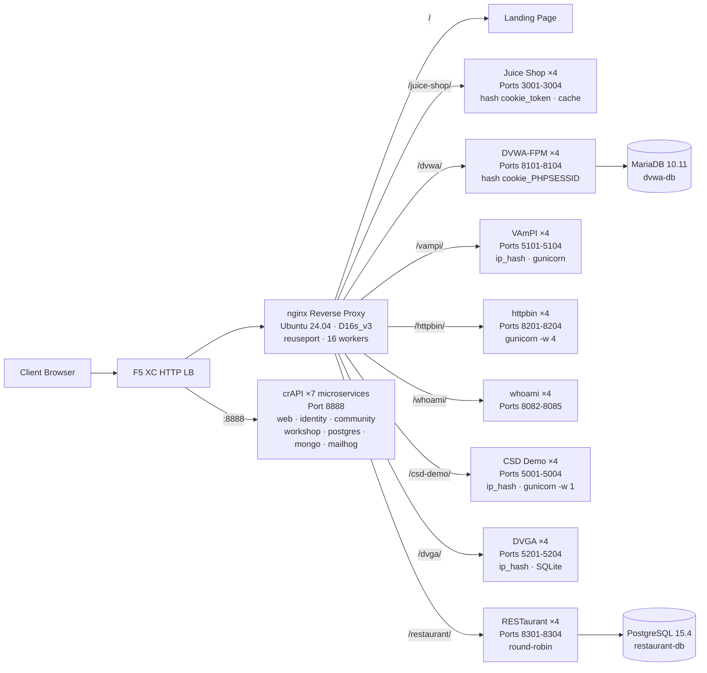

## วัตถุประสงค์

คอมโพเนนต์นี้ให้บริการเซิร์ฟเวอร์ต้นทาง (origin server) เดียวที่โฮสต์เว็บแอปพลิเคชันที่มีช่องโหว่หลายตัวสำหรับการสาธิตการทดสอบความปลอดภัย โดยทำหน้าที่เป็น "origin" ในสถาปัตยกรรม load balancer ทั่วไป -- เป็นเซิร์ฟเวอร์เนื้อหาแบ็กเอนด์ที่ F5 XC HTTP load balancer ปกป้อง

ในสถาปัตยกรรมการใช้งานจริง:

```
End User -> F5 XC HTTP LB (WAF/Bot/API Security) -> Origin Server -> Application
```

คอมโพเนนต์นี้แทนที่เซิร์ฟเวอร์แอปพลิเคชันจริงด้วย VM ที่สร้างขึ้นเฉพาะ ซึ่งรันแอปพลิเคชันที่มีช่องโหว่ที่เป็นที่รู้จัก เพื่อกระตุ้นกฎ WAF, นโยบาย API security และการตรวจจับบอท

## สถาปัตยกรรม



**41 คอนเทนเนอร์** บน VM Standard_D16s_v3 (16 vCPU, 64 GiB RAM, 60 GiB disk)

nginx reverse proxy:

- **รับฟังบนพอร์ต 80** ด้วย `reuseport` และ `backlog=4096` สำหรับทราฟฟิก CDN ที่มี concurrency สูง
- **กำหนดเส้นทางตาม path prefix** ไปยัง upstream pool ที่ทำ load balance (4 instance ต่อแอปพลิเคชัน)
- **Sticky sessions** ป้องกันการสูญเสียสถานะ: `hash $cookie_token` สำหรับ Juice Shop, `hash $cookie_PHPSESSID` สำหรับ DVWA, `ip_hash` สำหรับ VAmPI และ CSD Demo (SQLite/สถานะในหน่วยความจำต่อ instance)
- **Proxy cache** สำหรับ static assets ของ Juice Shop (โซน 10 MB, สูงสุด 100 MB, TTL 60 วินาที)
- **ปิด access logging** เพื่อป้องกันดิสก์เต็มภายใต้การทดสอบโหลด CDN (logrotate เป็นการป้องกันเชิงลึก)
- **ส่งต่อ client headers** (`X-Real-IP`, `X-Forwarded-For`, `X-Forwarded-Proto`) เพื่อให้ origin มองเห็นข้อมูล
- **ปรับแต่ง Kernel** ผ่าน sysctl: `somaxconn=65535`, `tcp_tw_reuse=1`, `ip_local_port_range=1024-65535`

## การแมปแอปพลิเคชัน

| เส้นทาง | Upstream | จำนวน Instance | พอร์ต | Sticky Session | วัตถุประสงค์ |
|---|---|---|---|---|---|
| `/` | nginx | -- | -- | -- | หน้าแลนดิ้งพร้อมลิงก์ไปยังแอปทั้งหมด |
| `/health` | nginx | -- | -- | -- | JSON health endpoint (แสดงแอป 9 ตัว) |
| `/juice-shop/` | juice_shop | 4 | 3001-3004 | `hash $cookie_token` | การรักษาความปลอดภัยเว็บแอปสมัยใหม่ (XSS, injection, CSRF) |
| `/dvwa/` | dvwa | 4 + MariaDB | 8101-8104 | `hash $cookie_PHPSESSID` | การทดสอบ WAF แบบคลาสสิกพร้อมระดับความยากที่ปรับได้ |
| `/vampi/` | vampi | 4 | 5101-5104 | `ip_hash` | การทดสอบความปลอดภัย REST API (OWASP API Top 10) |
| `/httpbin/` | httpbin_up | 4 | 8201-8204 | -- | บริการ HTTP request/response สำหรับสาธิต API |
| `/whoami/` | whoami_up | 4 | 8082-8085 | -- | การวินิจฉัย request -- แสดง headers ทั้งหมด, client IP |
| `/csd-demo/` | csd_demo | 4 | 5001-5004 | `ip_hash` | การทดสอบ Client-Side Defense (การโจมตี Magecart) |
| `/dvga/` | dvga | 4 | 5201-5204 | `ip_hash` | การทดสอบความปลอดภัย GraphQL API (injection, DoS, auth bypass) |
| `/restaurant/` | restaurant | 4 + PostgreSQL | 8301-8304 | -- | ความปลอดภัย REST API (OWASP API Top 10 2023) |
| `:8888` | crapi | 7 microservices | 8888 | -- | OWASP crAPI (BOLA, BFLA, mass assignment, SSRF, JWT) |

## การออกแบบคอมโพเนนต์แบบโมดูลาร์

นี่เป็นส่วนหนึ่งของสภาพแวดล้อมแล็บที่ใหญ่กว่า แต่ละคอมโพเนนต์เป็นหน่วยอิสระและถูก deploy แยกกัน:

- **คอมโพเนนต์นี้** ให้บริการเซิร์ฟเวอร์ต้นทาง (nginx + Docker containers บน Azure VM)
- **CDN Simulator** ให้บริการชั้น CDN edge (nginx caching บน Azure VM)
- **คอมโพเนนต์อื่น ๆ** ให้บริการการตั้งค่า F5 XC, DNS, นโยบาย WAF, API security เป็นต้น

ผู้ดำเนินการเพิ่มคอมโพเนนต์ทีละตัว เอกสารของแต่ละคอมโพเนนต์เขียนขึ้นเพื่อให้ผู้ช่วย AI สามารถอ่านและ deploy โครงสร้างพื้นฐานได้อย่างอัตโนมัติ

## เหตุผลที่เลือกแอปพลิเคชันเหล่านี้

| แอปพลิเคชัน | เหตุผลที่เลือก |
|---|---|
| **Juice Shop** | โครงการหลักของ OWASP; SPA Node.js สมัยใหม่พร้อมความท้าทายมากกว่า 100 รายการที่ครอบคลุม OWASP Top 10; ได้รับการดูแลอย่างต่อเนื่อง; 4 instance พร้อม proxy cache |
| **DVWA** | มาตรฐานอุตสาหกรรมสำหรับการทดสอบ WAF; ระดับความปลอดภัยที่ปรับได้ (low/medium/high/impossible); สร้างแบบกำหนดเองด้วย php-fpm + nginx เพื่อประสิทธิภาพ; ใช้ MariaDB 10.11 แบ็กเอนด์ร่วมกัน |
| **VAmPI** | สร้างขึ้นเฉพาะสำหรับ OWASP API Security Top 10; REST API พร้อมช่องโหว่ที่ทราบ; gunicorn พร้อม 4 workers ต่อ instance; ip_hash sticky สำหรับความสอดคล้องของ SQLite |
| **httpbin** | บริการทดสอบ HTTP มาตรฐานของ Kenneth Reitz; gunicorn พร้อม 4 gevent workers; มีประโยชน์สำหรับสาธิต API และตรวจสอบ request |
| **whoami** | เซิร์ฟเวอร์ echo request ของ Traefik; แสดงรายละเอียด request ทั้งหมดตามที่ origin เห็น -- จำเป็นสำหรับการตรวจสอบการ inject header ของ F5 XC |
| **CSD Demo** | หน้าชำระเงินแบบกำหนดเองพร้อมการโจมตีสไตล์ Magecart ที่สลับเปิด/ปิดได้ 5 แบบ (card skimmer, formjacker, keylogger, cryptominer, DOM hijack); exfil endpoint + แดชบอร์ดผู้โจมตี; gunicorn single-worker สำหรับการคงสถานะในหน่วยความจำ |
| **DVGA** | Damn Vulnerable GraphQL Application; ช่องโหว่เฉพาะ GraphQL รวมถึง injection, DoS, batching attacks และ authorization bypass; GraphiQL UI สำหรับการสำรวจแบบโต้ตอบ; ip_hash sticky สำหรับ SQLite ต่อ instance |
| **RESTaurant** | Damn Vulnerable RESTaurant API Game; สร้างขึ้นเฉพาะสำหรับ OWASP API Security Top 10 2023; FastAPI พร้อม Swagger UI; ใช้ PostgreSQL 15.4 แบ็กเอนด์ร่วมกัน; ครอบคลุม BOLA, BFLA, mass assignment, SSRF และ injection |
| **crAPI** | OWASP Completely Ridiculous API; สถาปัตยกรรม 7 microservices ครอบคลุม BOLA, BFLA, mass assignment, SSRF, JWT manipulation และ NoSQL injection; พอร์ตเฉพาะ 8888 (SPA พร้อม API paths ที่ hardcode ไว้); MailHog สำหรับจับอีเมล |
