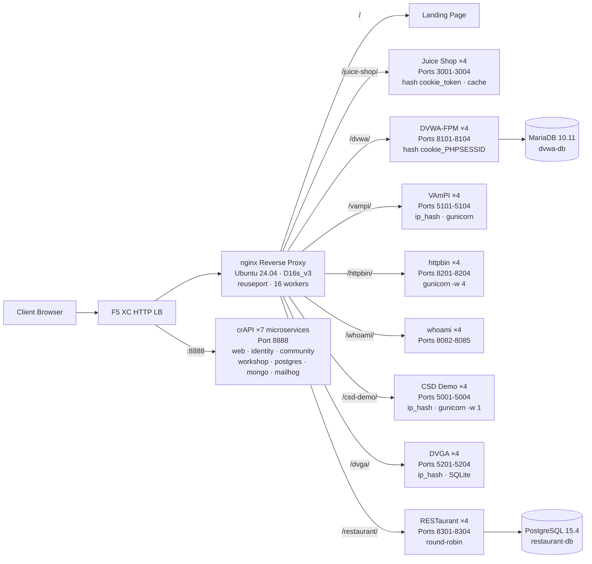

## วัตถุประสงค์

ส่วนประกอบนี้จัดเตรียมเซิร์ฟเวอร์ต้นทางเดียวที่โฮสต์แอปพลิเคชันเว็บที่มีช่องโหว่หลายรายการสำหรับการสาธิตการทดสอบความปลอดภัย โดยแสดงถึง "ต้นทาง" ในสถาปัตยกรรม load balancer แบบทั่วไป -- เซิร์ฟเวอร์เนื้อหาแบ็กเอนด์ที่ F5 XC HTTP load balancer ปกป้อง

ในสถาปัตยกรรมการใช้งานจริง:

```
End User -> F5 XC HTTP LB (WAF/Bot/API Security) -> Origin Server -> Application
```

ส่วนประกอบนี้แทนที่เซิร์ฟเวอร์แอปพลิเคชันการใช้งานจริงด้วย VM ที่สร้างขึ้นเพื่อวัตถุประสงค์เฉพาะ ซึ่งรันแอปพลิเคชันที่มีช่องโหว่ที่เป็นที่รู้จักกันดี ซึ่งจะกระตุ้นกฎ WAF นโยบายความปลอดภัย API และการตรวจจับ bot

## สถาปัตยกรรม



**41 คอนเทนเนอร์** บน VM แบบ Standard_D16s_v3 (16 vCPU, 64 GiB RAM, 60 GiB disk)

nginx reverse proxy:

- **รับฟังบนพอร์ต 80** ด้วย `reuseport` และ `backlog=4096` สำหรับทราฟฟิก CDN ที่มีการทำงานพร้อมกันสูง
- **กำหนดเส้นทางตามคำนำหน้าพาธ** ไปยังพูล upstream แบบ load-balanced (4 อินสแตนซ์ต่อแอปพลิเคชัน)
- **Sticky sessions** ป้องกันการสูญเสียสถานะ: `hash $cookie_token` สำหรับ Juice Shop, `hash $cookie_PHPSESSID` สำหรับ DVWA, `ip_hash` สำหรับ VAmPI และ CSD Demo (สถานะ SQLite/in-memory ต่ออินสแตนซ์)
- **Proxy cache** สำหรับสินทรัพย์แบบสแตติกของ Juice Shop (โซน 10 MB, สูงสุด 100 MB, TTL 60 วินาที)
- **ปิดการบันทึกการเข้าถึง** เพื่อป้องกันดิสก์เต็มภายใต้การทดสอบโหลด CDN (logrotate เป็นการป้องกันเชิงลึก)
- **ส่งผ่านส่วนหัวของไคลเอนต์** (`X-Real-IP`, `X-Forwarded-For`, `X-Forwarded-Proto`) เพื่อให้ต้นทางมองเห็นได้
- **การปรับแต่ง Kernel** ผ่าน sysctl: `somaxconn=65535`, `tcp_tw_reuse=1`, `ip_local_port_range=1024-65535`

## การแมปแอปพลิเคชัน

| พาธ | Upstream | อินสแตนซ์ | พอร์ต | Sticky Session | วัตถุประสงค์ |
|---|---|---|---|---|---|
| `/` | nginx | -- | -- | -- | หน้า Landing พร้อมลิงก์ไปยังแอปทั้งหมด |
| `/health` | nginx | -- | -- | -- | JSON health endpoint (แสดงรายการ 9 แอป) |
| `/juice-shop/` | juice_shop | 4 | 3001-3004 | `hash $cookie_token` | ความปลอดภัยแอปเว็บสมัยใหม่ (XSS, injection, CSRF) |
| `/dvwa/` | dvwa | 4 + MariaDB | 8101-8104 | `hash $cookie_PHPSESSID` | การทดสอบ WAF แบบคลาสสิกพร้อมระดับความยากที่ปรับได้ |
| `/vampi/` | vampi | 4 | 5101-5104 | `ip_hash` | การทดสอบความปลอดภัย REST API (OWASP API Top 10) |
| `/httpbin/` | httpbin_up | 4 | 8201-8204 | -- | บริการ HTTP request/response สำหรับการสาธิต API |
| `/whoami/` | whoami_up | 4 | 8082-8085 | -- | การวินิจฉัยคำขอ -- แสดงส่วนหัวทั้งหมด, IP ของไคลเอนต์ |
| `/csd-demo/` | csd_demo | 4 | 5001-5004 | `ip_hash` | การทดสอบการป้องกันฝั่งไคลเอนต์ (การโจมตี Magecart) |
| `/dvga/` | dvga | 4 | 5201-5204 | `ip_hash` | การทดสอบความปลอดภัย GraphQL API (injection, DoS, auth bypass) |
| `/restaurant/` | restaurant | 4 + PostgreSQL | 8301-8304 | -- | ความปลอดภัย REST API (OWASP API Top 10 2023) |
| `:8888` | crapi | 7 microservices | 8888 | -- | OWASP crAPI (BOLA, BFLA, mass assignment, SSRF, JWT) |

## การออกแบบส่วนประกอบแบบโมดูลาร์

นี่คือส่วนหนึ่งของสภาพแวดล้อมแล็บที่ใหญ่กว่า ส่วนประกอบแต่ละชิ้นเป็นแบบอิสระและปรับใช้งานอย่างเป็นอิสระ:

- **ส่วนประกอบนี้** จัดเตรียมเซิร์ฟเวอร์ต้นทาง (nginx + Docker containers บน Azure VM)
- **ตัวจำลอง CDN** จัดเตรียมเลเยอร์ CDN edge (nginx caching บน Azure VM)
- **ส่วนประกอบอื่น ๆ** จัดเตรียมการกำหนดค่า F5 XC, DNS, นโยบาย WAF, ความปลอดภัย API และอื่น ๆ

ผู้ดำเนินการเพิ่มส่วนประกอบทีละชิ้น เอกสารของส่วนประกอบแต่ละชิ้นเขียนขึ้นเพื่อให้ผู้ช่วย AI สามารถอ่านและปรับใช้โครงสร้างพื้นฐานได้โดยอัตโนมัติ

## เหตุผลในการเลือกแอปพลิเคชันเหล่านี้

| แอปพลิเคชัน | เหตุผลที่เลือก |
|---|---|
| **Juice Shop** | โปรเจกต์หลักของ OWASP; SPA แบบ Node.js สมัยใหม่พร้อมความท้าทายมากกว่า 100 รายการที่ครอบคลุม OWASP Top 10; ได้รับการดูแลอย่างต่อเนื่อง; 4 อินสแตนซ์พร้อม proxy cache |
| **DVWA** | มาตรฐานอุตสาหกรรมสำหรับการทดสอบ WAF; ระดับความปลอดภัยที่ปรับได้ (ต่ำ/กลาง/สูง/เป็นไปไม่ได้); สร้างแบบกำหนดเองด้วย php-fpm + nginx เพื่อประสิทธิภาพ; แบ็กเอนด์ MariaDB 10.11 ที่ใช้ร่วมกัน |
| **VAmPI** | สร้างขึ้นเพื่อวัตถุประสงค์เฉพาะสำหรับ OWASP API Security Top 10; REST API พร้อมช่องโหว่ที่ทราบ; gunicorn พร้อม 4 workers ต่ออินสแตนซ์; ip_hash sticky เพื่อความสอดคล้องของ SQLite |
| **httpbin** | บริการทดสอบ HTTP ที่เป็นบรรทัดฐานของ Kenneth Reitz; gunicorn พร้อม 4 gevent workers; มีประโยชน์สำหรับการสาธิต API และการตรวจสอบคำขอ |
| **whoami** | เซิร์ฟเวอร์ echo คำขอของ Traefik; แสดงรายละเอียดคำขอทั้งหมดตามที่ต้นทางมองเห็น -- จำเป็นสำหรับการยืนยันการ inject ส่วนหัวของ F5 XC |
| **CSD Demo** | หน้า checkout แบบกำหนดเองพร้อมการโจมตีสไตล์ Magecart ที่สลับได้ 5 รายการ (card skimmer, formjacker, keylogger, cryptominer, DOM hijack); exfil endpoint + แดชบอร์ดของผู้โจมตี; gunicorn single-worker เพื่อความคงอยู่ของสถานะ in-memory |
| **DVGA** | Damn Vulnerable GraphQL Application; ช่องโหว่เฉพาะ GraphQL รวมถึง injection, DoS, batching attacks และ authorization bypass; GraphiQL UI สำหรับการสำรวจแบบโต้ตอบ; ip_hash sticky สำหรับ SQLite ต่ออินสแตนซ์ |
| **RESTaurant** | Damn Vulnerable RESTaurant API Game; สร้างขึ้นเพื่อวัตถุประสงค์เฉพาะสำหรับ OWASP API Security Top 10 2023; FastAPI พร้อม Swagger UI; แบ็กเอนด์ PostgreSQL 15.4 ที่ใช้ร่วมกัน; ครอบคลุม BOLA, BFLA, mass assignment, SSRF และ injection |
| **crAPI** | OWASP Completely Ridiculous API; สถาปัตยกรรม 7 microservices ที่ครอบคลุม BOLA, BFLA, mass assignment, SSRF, JWT manipulation และ NoSQL injection; พอร์ตเฉพาะ 8888 (SPA พร้อม API paths ที่ฮาร์ดโค้ด); MailHog สำหรับการดักจับอีเมล |
