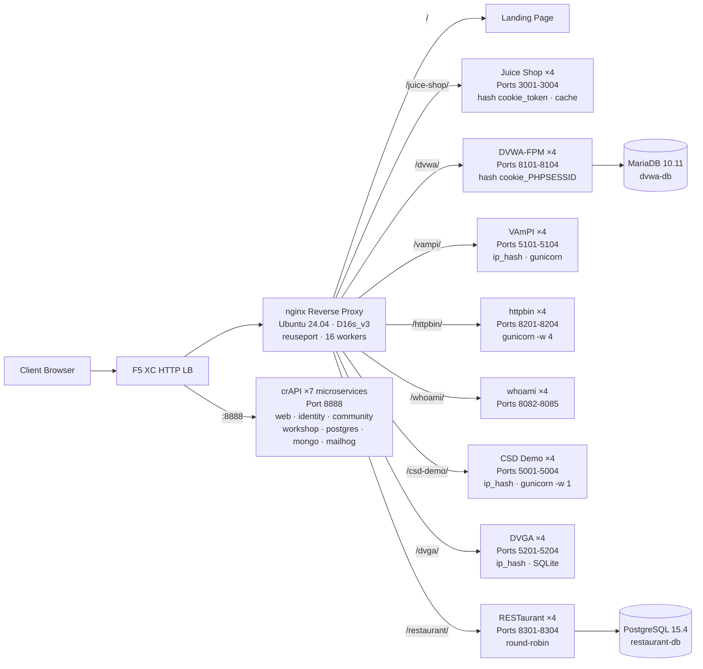

## 用途

该组件提供一台单一源服务器，托管多个用于安全测试演示的漏洞 Web 应用程序。它代表典型负载均衡架构中的"源站"——即由 F5 XC HTTP 负载均衡器所保护的后端内容服务器。

在生产架构中：

```
End User -> F5 XC HTTP LB (WAF/Bot/API Security) -> Origin Server -> Application
```

该组件以一台专门构建的虚拟机替代真实的生产应用服务器，该虚拟机运行多个知名漏洞应用程序，用于触发 WAF 规则、API 安全策略和机器人检测。

## 架构



**41 个容器**部署于 Standard_D16s_v3 虚拟机（16 vCPU，64 GiB RAM，60 GiB 磁盘）。

nginx 反向代理：

- **监听 80 端口**，配置 `reuseport` 和 `backlog=4096`，以支持高并发 CDN 流量
- **按路径前缀路由**至负载均衡上游池（每个应用程序 4 个实例）
- **粘性会话**防止状态丢失：Juice Shop 使用 `hash $cookie_token`，DVWA 使用 `hash $cookie_PHPSESSID`，VAmPI 和 CSD Demo 使用 `ip_hash`（每个实例维护 SQLite/内存状态）
- **代理缓存**用于 Juice Shop 静态资源（10 MB 缓存区，最大 100 MB，TTL 60 秒）
- **禁用访问日志**以防止 CDN 压力测试期间磁盘耗尽（logrotate 作为纵深防御措施）
- **传递客户端请求头**（`X-Real-IP`、`X-Forwarded-For`、`X-Forwarded-Proto`）以提升源站可见性
- **通过 sysctl 进行内核调优**：`somaxconn=65535`、`tcp_tw_reuse=1`、`ip_local_port_range=1024-65535`

## 应用程序映射

| 路径 | 上游 | 实例数 | 端口 | 粘性会话 | 用途 |
|---|---|---|---|---|---|
| `/` | nginx | -- | -- | -- | 包含所有应用链接的落地页 |
| `/health` | nginx | -- | -- | -- | JSON 健康检查端点（列出 9 个应用） |
| `/juice-shop/` | juice_shop | 4 | 3001-3004 | `hash $cookie_token` | 现代 Web 应用安全（XSS、注入、CSRF） |
| `/dvwa/` | dvwa | 4 + MariaDB | 8101-8104 | `hash $cookie_PHPSESSID` | 可调难度的经典 WAF 测试 |
| `/vampi/` | vampi | 4 | 5101-5104 | `ip_hash` | REST API 安全测试（OWASP API Top 10） |
| `/httpbin/` | httpbin_up | 4 | 8201-8204 | -- | 用于 API 演示的 HTTP 请求/响应服务 |
| `/whoami/` | whoami_up | 4 | 8082-8085 | -- | 请求诊断——显示所有请求头和客户端 IP |
| `/csd-demo/` | csd_demo | 4 | 5001-5004 | `ip_hash` | 客户端防御测试（Magecart 攻击） |
| `/dvga/` | dvga | 4 | 5201-5204 | `ip_hash` | GraphQL API 安全测试（注入、DoS、认证绕过） |
| `/restaurant/` | restaurant | 4 + PostgreSQL | 8301-8304 | -- | REST API 安全（OWASP API Top 10 2023） |
| `:8888` | crapi | 7 个微服务 | 8888 | -- | OWASP crAPI（BOLA、BFLA、批量赋值、SSRF、JWT） |

## 模块化组件设计

这是一个较大实验室环境中的单一组件。每个组件均自包含并独立部署：

- **本组件**提供源服务器（Azure 虚拟机上的 nginx + Docker 容器）
- **CDN 模拟器**提供 CDN 边缘层（Azure 虚拟机上的 nginx 缓存）
- **其他组件**提供 F5 XC 配置、DNS、WAF 策略、API 安全等功能

人工操作员每次添加一个组件。每个组件的文档均经过专门编写，以便 AI 助手能够读取并自主部署基础设施。

## 选用这些应用程序的原因

| 应用程序 | 选用原因 |
|---|---|
| **Juice Shop** | OWASP 旗舰项目；现代 Node.js SPA，包含 100 余个挑战，覆盖 OWASP Top 10；持续维护；4 个实例配置代理缓存 |
| **DVWA** | WAF 测试的行业标准；支持可调安全级别（低/中/高/不可能）；采用定制 php-fpm + nginx 构建以提升性能；共享 MariaDB 10.11 后端 |
| **VAmPI** | 专为 OWASP API 安全 Top 10 构建；具有已知漏洞的 REST API；每个实例使用 gunicorn 配置 4 个 worker；ip_hash 粘性会话保证 SQLite 一致性 |
| **httpbin** | Kenneth Reitz 的标准 HTTP 测试服务；gunicorn 配置 4 个 gevent worker；适用于 API 演示和请求检查 |
| **whoami** | Traefik 的请求回显服务器；以源站视角展示完整请求详情——是验证 F5 XC 请求头注入的必备工具 |
| **CSD Demo** | 自定义结帐页面，支持 5 种可切换的 Magecart 风格攻击（信用卡窃取、表单劫持、键盘记录、加密货币挖矿、DOM 劫持）；包含数据泄露端点和攻击者控制面板；gunicorn 单 worker 保证内存状态持久化 |
| **DVGA** | Damn Vulnerable GraphQL Application；包含 GraphQL 专项漏洞，涵盖注入、DoS、批量攻击和授权绕过；提供 GraphiQL UI 供交互式探索；ip_hash 粘性会话保证每实例 SQLite 独立性 |
| **RESTaurant** | Damn Vulnerable RESTaurant API Game；专为 OWASP API 安全 Top 10 2023 构建；采用 FastAPI 并提供 Swagger UI；共享 PostgreSQL 15.4 后端；涵盖 BOLA、BFLA、批量赋值、SSRF 和注入 |
| **crAPI** | OWASP Completely Ridiculous API；7 微服务架构，涵盖 BOLA、BFLA、批量赋值、SSRF、JWT 操纵和 NoSQL 注入；专用端口 8888（SPA 具有硬编码 API 路径）；MailHog 用于邮件捕获 |
