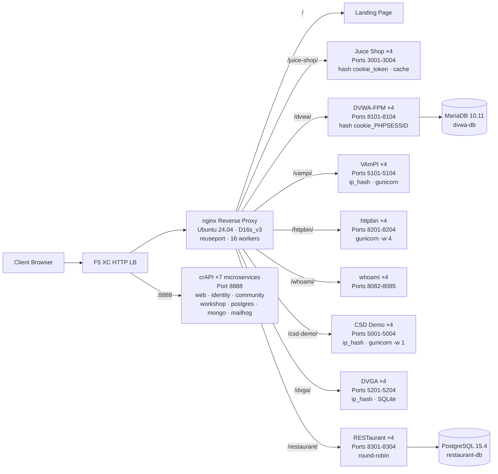

## 用途

此元件提供一個單一來源伺服器，託管多個有漏洞的 Web 應用程式，用於安全測試示範。它代表典型負載平衡器架構中的「來源端」——即 F5 XC HTTP 負載平衡器所保護的後端內容伺服器。

在生產架構中：

```
End User -> F5 XC HTTP LB (WAF/Bot/API Security) -> Origin Server -> Application
```

此元件以一台執行知名有漏洞應用程式的專用虛擬機器，取代真實的生產應用程式伺服器，用以觸發 WAF 規則、API 安全策略及機器人偵測。

## 架構



**41 個容器**部署於 Standard_D16s_v3 虛擬機器（16 vCPU、64 GiB RAM、60 GiB 磁碟）。

nginx 反向代理：

- **監聽埠 80**，搭配 `reuseport` 與 `backlog=4096`，以應對高並發的 CDN 流量
- **依路徑前綴路由**至負載平衡的上游池（每個應用程式 4 個實例）
- **黏性會話**防止狀態遺失：Juice Shop 使用 `hash $cookie_token`，DVWA 使用 `hash $cookie_PHPSESSID`，VAmPI 與 CSD Demo 使用 `ip_hash`（每個實例的 SQLite／記憶體內狀態）
- **代理快取**用於 Juice Shop 靜態資源（10 MB 區域、100 MB 上限、60 秒 TTL）
- **停用存取日誌**以防止 CDN 壓力測試下磁碟耗盡（logrotate 作為深度防禦）
- **傳遞用戶端標頭**（`X-Real-IP`、`X-Forwarded-For`、`X-Forwarded-Proto`）以提升來源端可見性
- **透過 sysctl 進行核心調校**：`somaxconn=65535`、`tcp_tw_reuse=1`、`ip_local_port_range=1024-65535`

## 應用程式對應

| 路徑 | 上游 | 實例數 | 埠號 | 黏性會話 | 用途 |
|---|---|---|---|---|---|
| `/` | nginx | -- | -- | -- | 含所有應用程式連結的登陸頁面 |
| `/health` | nginx | -- | -- | -- | JSON 健康狀態端點（列出 9 個應用程式） |
| `/juice-shop/` | juice_shop | 4 | 3001-3004 | `hash $cookie_token` | 現代 Web 應用程式安全（XSS、注入、CSRF） |
| `/dvwa/` | dvwa | 4 + MariaDB | 8101-8104 | `hash $cookie_PHPSESSID` | 可調整難度的傳統 WAF 測試 |
| `/vampi/` | vampi | 4 | 5101-5104 | `ip_hash` | REST API 安全測試（OWASP API Top 10） |
| `/httpbin/` | httpbin_up | 4 | 8201-8204 | -- | 用於 API 示範的 HTTP 請求／回應服務 |
| `/whoami/` | whoami_up | 4 | 8082-8085 | -- | 請求診斷——顯示所有標頭與用戶端 IP |
| `/csd-demo/` | csd_demo | 4 | 5001-5004 | `ip_hash` | 用戶端防禦測試（Magecart 攻擊） |
| `/dvga/` | dvga | 4 | 5201-5204 | `ip_hash` | GraphQL API 安全測試（注入、DoS、授權繞過） |
| `/restaurant/` | restaurant | 4 + PostgreSQL | 8301-8304 | -- | REST API 安全（OWASP API Top 10 2023） |
| `:8888` | crapi | 7 個微服務 | 8888 | -- | OWASP crAPI（BOLA、BFLA、大量賦值、SSRF、JWT） |

## 模組化元件設計

這是較大型實驗室環境中的一個部分。每個元件均獨立且分別部署：

- **此元件**提供來源伺服器（nginx + Azure VM 上的 Docker 容器）
- **CDN 模擬器**提供 CDN 邊緣層（Azure VM 上的 nginx 快取）
- **其他元件**提供 F5 XC 設定、DNS、WAF 策略、API 安全性等

操作人員每次新增一個元件。每個元件的文件均以 AI 助理可讀取並自主部署基礎設施的方式撰寫。

## 選用這些應用程式的理由

| 應用程式 | 選用原因 |
|---|---|
| **Juice Shop** | OWASP 旗艦專案；現代 Node.js SPA，包含 100 多個涵蓋 OWASP Top 10 的挑戰；持續維護；4 個實例搭配代理快取 |
| **DVWA** | WAF 測試的業界標準；可調整安全等級（低／中／高／不可能）；自訂 php-fpm + nginx 建置以提升效能；共用 MariaDB 10.11 後端 |
| **VAmPI** | 專為 OWASP API Security Top 10 設計；具有已知漏洞的 REST API；每個實例使用 gunicorn 搭配 4 個 worker；ip_hash 黏性以確保 SQLite 一致性 |
| **httpbin** | Kenneth Reitz 的標準 HTTP 測試服務；gunicorn 搭配 4 個 gevent worker；適用於 API 示範與請求檢查 |
| **whoami** | Traefik 的請求回應伺服器；以來源端視角顯示完整請求詳情——對驗證 F5 XC 標頭注入不可或缺 |
| **CSD Demo** | 自訂結帳頁面，內含 5 種可切換的 Magecart 風格攻擊（卡片側錄、表單劫持、鍵盤記錄、挖礦程式、DOM 劫持）；含外洩端點與攻擊者儀表板；gunicorn 單一 worker 以維持記憶體內狀態持久性 |
| **DVGA** | Damn Vulnerable GraphQL Application；GraphQL 特有漏洞，包括注入、DoS、批次攻擊及授權繞過；GraphiQL UI 供互動式探索；ip_hash 黏性以確保每個實例的 SQLite 獨立性 |
| **RESTaurant** | Damn Vulnerable RESTaurant API Game；專為 OWASP API Security Top 10 2023 設計；FastAPI 搭配 Swagger UI；共用 PostgreSQL 15.4 後端；涵蓋 BOLA、BFLA、大量賦值、SSRF 及注入 |
| **crAPI** | OWASP Completely Ridiculous API；7 個微服務架構，涵蓋 BOLA、BFLA、大量賦值、SSRF、JWT 操控及 NoSQL 注入；專用埠 8888（SPA 含硬編碼 API 路徑）；MailHog 用於電子郵件擷取 |
